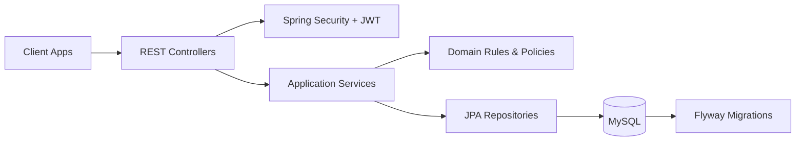

# Attendance Check By QR Code

[](https://github.com/binkadev/Attendance-Check-By-QRcode/actions/workflows/backend-ci.yml)


> Production-like Spring Boot backend for QR-based classroom attendance management.

**Status note:** Academic/portfolio backend project with around 90% of the initial backend scope implemented. This repository is intentionally described as **production-like**, not as a deployed production system.

## Quick Summary

| Item | Details |
|---|---|
| Project type | Backend engineering project (academic/portfolio) for QR-based attendance workflows |
| Main stack | Java 17, Spring Boot 3.x, Spring Security, Spring Data JPA/Hibernate, MySQL, Flyway |
| API style | RESTful `/api/v1/**` endpoints with OpenAPI contract |
| Security model | JWT auth + persisted refresh sessions + password reset/session-abuse tracking tables |
| Database strategy | Flyway-first migrations, UUID binary keys, relational constraints, indexed query paths |
| Testing/CI | JUnit 5, Mockito, Spring Boot/MockMvc integration-style tests, GitHub Actions + MySQL service |
| Status | Production-like backend design; deployment hardening and some contract alignment still pending |

## Why This Project Exists

Classroom attendance looks simple at first, but a reliable backend needs more than CRUD records.

A real attendance workflow must answer questions such as:

- Who is allowed to create, open, close, or modify an attendance session?
- When is a QR check-in valid?
- Should a student be marked `PRESENT`, `LATE`, `ABSENT`, or `EXCUSED`?
- How are manual corrections controlled and audited?
- How should absence requests be reviewed and reverted?
- How can suspicious check-in attempts or account-abuse signals be monitored?

This project models those concerns through application rules, database-level safeguards, API contract documentation, and automated test support.

## Engineering Highlights

- **Session-scoped QR token model**: QR tokens are rotated per attendance session and validated against session context, reducing token misuse across sessions.
- **Server-side refresh-session persistence**: auth flow includes persisted session lifecycle records such as issue/use/revoke metadata, enabling logout-all and abuse-aware operations.
- **Flyway-first schema evolution**: schema changes are versioned in migrations, keeping database evolution auditable and reproducible.
- **Data integrity hardening**: foreign keys, unique constraints, check constraints, and trigger-based protections are used for critical attendance/absence invariants.
- **Attendance and policy rules**: explicit status/state logic for check-in windows, late thresholds, manual overrides, and policy warning/critical surfaces.
- **CI with realistic DB setup**: GitHub Actions uses a MySQL 8 service and explicit collation preparation before running backend tests.
- **OpenAPI-backed contract**: the API surface is documented in-repo to support client integration and reviewer onboarding.

## Demo & Screenshots

| Area | Planned preview | Status |
|---|---|---|
| Mobile class list | Student view of enrolled classes and filters | Planned |
| QR check-in flow | Session QR rotation + student scan/check-in result | Planned |
| Attendance session management | Lecturer open/close/cancel/reopen session actions | Planned |
| Absence request workflow | Student submit + reviewer approve/reject/revert | Planned |
| OpenAPI documentation | Swagger/OpenAPI contract walkthrough | Planned |
| GitHub Actions CI pass | Successful backend-ci workflow run snapshot | Planned |
| Database / architecture overview | ER-style relationships + layered architecture diagram | Planned |

## Core Workflows

### 1) Account security

Register/login/refresh/logout/logout-all and password change/reset endpoints provide full account lifecycle surfaces. Backing tables for sessions, login attempts, and password-reset attempts support operational security review in addition to happy-path authentication.

### 2) Class and membership management

Groups/classes are created and managed with role/state-aware operations such as `OWNER`, `CO_HOST`, `MEMBER`, and membership states such as `PENDING` / `APPROVED`.

Metadata such as semester, academic year, course/class code, campus/room, and schedule limits supports both operational teaching use and mobile filtering use cases.

### 3) QR attendance workflow

Attendance sessions are created per group and constrained by session state and check-in window timing. QR token rotation and session-bound validation are central to the workflow.

After a valid scan, attendance status is computed as `PRESENT` or `LATE` based on threshold rules.

### 4) Manual correction and absence workflow

Manual attendance operations exist but remain constrained by session settings and permissions. `EXCUSED` is routed through absence review/revert workflows to keep exception handling explicit and auditable.

### 5) Attendance policy and monitoring

Group-level attendance policy configuration supports warning/critical thresholds, including rate-based and/or absence-count-style inputs.

Monitoring-related surfaces include notifications, admin security summaries, check-in attempt logs, and fraud incident tracking APIs.

### 6) API/database/CI support

The API surface is contract-documented via OpenAPI, while database behavior is migration-driven with integrity controls.

CI enforces backend tests in a MySQL-backed environment for repeatable validation.

## Architecture



## Database Design

Flyway migration location:

- `backend springboot/src/main/resources/db/migration`

### Core tables

- `users`
- `class_groups`
- `group_members`
- `attendance_sessions`
- `session_attendance`
- `absence_requests`
- `attendance_events`

### Extended tables

- `qr_tokens`
- `user_sessions`
- `password_reset_tokens`
- `password_reset_attempts`
- `login_attempts`
- `email_outbox`
- `attendance_policies`
- `notifications`
- `notification_deliveries`
- `notification_rule_configs`
- `checkin_attempt_logs`
- `fraud_incidents`
- `group_weekly_schedules`

### Key relationships

| Relationship | Design intent |
|---|---|
| `users -> group_members -> class_groups` | Membership and role/state access control for class operations |
| `class_groups -> attendance_sessions` | Sessions are scoped to a class/group lifecycle |
| `attendance_sessions -> session_attendance` | Attendance rows are anchored to a specific session/user pair |
| `attendance_sessions -> qr_tokens` | QR rotation/validation remains session-bound |
| `absence_requests -> excused attendance flow` | Approved absence integrates with attendance exception handling |
| `notifications -> notification_deliveries` | Notification content and channel-delivery lifecycle are separated |
| `checkin_attempt_logs -> fraud_incidents` | Attempt telemetry supports incident-level fraud monitoring workflows |

### Integrity techniques used

- Foreign keys for relationship safety
- Unique constraints for domain invariants
- Check constraints for state/range validity
- Indexes for common query paths such as self-read, history, and monitoring
- Trigger-based hardening for selected workflows

## API Documentation

OpenAPI contract:

- `backend springboot/src/main/resources/static/openapi.yaml`

Endpoint groups include:

- Auth
- Me
- Groups
- Members
- Sessions
- QR
- Attendance
- Absence
- Events
- Notifications
- Fraud
- Admin Security

## Testing

Test source:

- `backend springboot/src/test/java`

Test configuration helpers:

- `backend springboot/src/test/resources/application-test.yml`
- `backend springboot/src/test/resources/sql`

Tested areas, representative:

- attendance read/summary logic
- session service behavior
- group service behavior
- admin security aggregation
- controller/API behavior with MockMvc

Run tests on Linux/macOS:

```bash
cd "backend springboot"
./mvnw test
```

Run tests on Windows PowerShell:

```powershell
cd "backend springboot"
./mvnw.cmd test
```

## GitHub Actions CI

Workflow file:

- `.github/workflows/backend-ci.yml`

Current behavior:

- Triggers on `push`, `pull_request`, and `workflow_dispatch`
- Starts MySQL 8 service
- Applies collation setup step
- Runs backend Maven tests
- Uploads Surefire reports for CI debugging when configured

## Run Locally

Prerequisites:

- JDK 17+
- MySQL 8.x
- Maven Wrapper: `mvnw` / `mvnw.cmd`
- Redis for features relying on Redis-backed components

### 1) Create local database

```sql
CREATE DATABASE attendance_dev
  CHARACTER SET utf8mb4
  COLLATE utf8mb4_unicode_ci;
```

### 2) Clone and run on Linux/macOS

```bash
git clone https://github.com/binkadev/Attendance-Check-By-QRcode.git
cd Attendance-Check-By-QRcode
cd "backend springboot"
./mvnw spring-boot:run -Pdev
```

### 3) Clone and run on Windows PowerShell

```powershell
git clone https://github.com/binkadev/Attendance-Check-By-QRcode.git
cd Attendance-Check-By-QRcode
cd "backend springboot"
./mvnw.cmd spring-boot:run -Pdev
```

> Note: `backend springboot` contains a space; keep quotes around the path in shell commands.

## Docker

Dockerfile:

- `backend springboot/Dockerfile`

Build and run:

```bash
cd "backend springboot"
docker build -t attendance-backend:local .
docker run --rm -p 8081:8081 attendance-backend:local
```

> Runtime connectivity still depends on external services such as MySQL and Redis according to active profile settings.

## Project Status

- Strongly implemented: core attendance domain APIs, Flyway schema evolution, testing patterns, CI workflow.
- Describe carefully: notification delivery maturity, fraud automation maturity, and deployment hardening are not claimed as production-complete.

## Known Technical Debt

- Fraud incident enum alignment across OpenAPI vs backend/DB constraints
- Wider end-to-end verification for notification delivery behavior
- Expanded deployment/environment matrix documentation

## Roadmap

- Align fraud enums across OpenAPI/backend/DB
- Expand notification end-to-end test coverage
- Add deeper edge-case and concurrency tests for role/session/check-in paths
- Improve deployment and observability documentation
- Add final screenshots and workflow previews for GitHub/CV presentation

## Author

**binkadev**  
PTIT D22

## What Makes This Project Worth Reviewing

This project is worth reviewing because it demonstrates backend engineering judgment, not just endpoint volume.

It highlights permission-aware workflows, attendance state transitions, session-scoped QR validation, integrity-focused migration design, audit/monitoring surfaces, and CI-backed test execution in a database-aware environment.

The project is intentionally presented as a production-like backend project rather than a fully deployed production system.