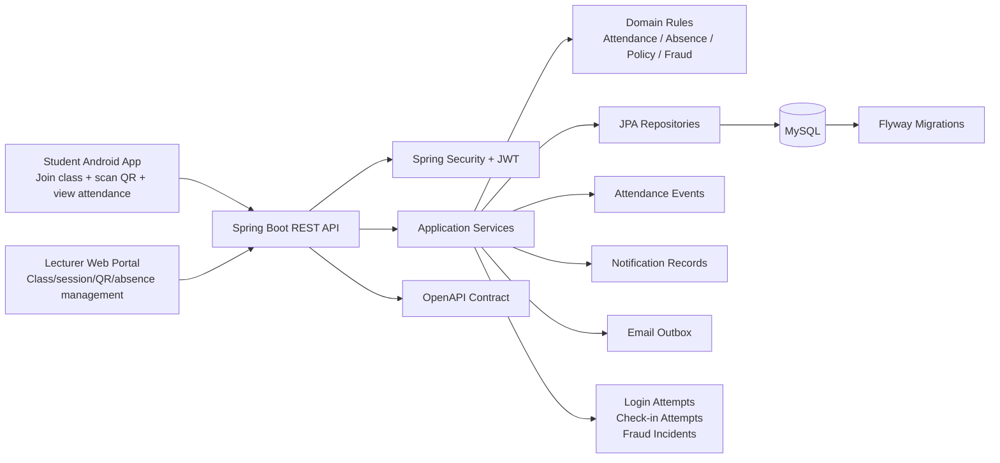
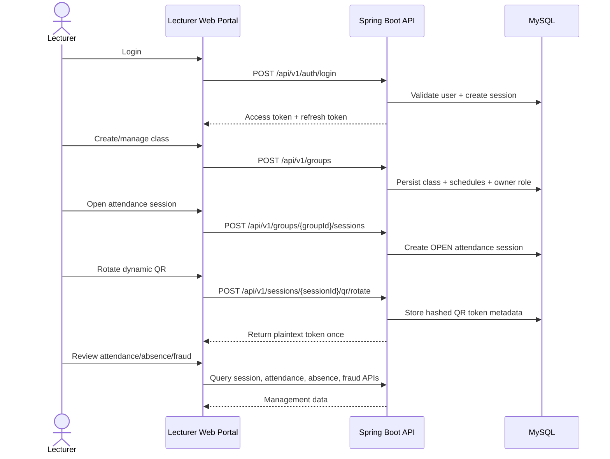
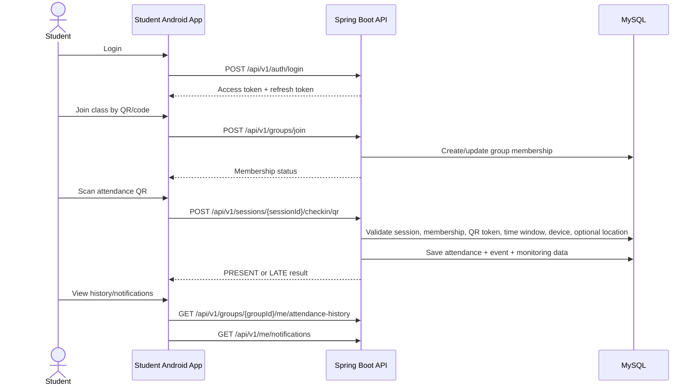

# Attendance Check By QR Code

[](https://github.com/binkadev/Attendance-Check-By-QRcode/actions/workflows/backend-ci.yml)


A production-like QR attendance platform with a clear client split:

- **Lecturer Web Portal** for managing classes, students, attendance sessions, dynamic QR codes, manual corrections, absence requests, and monitoring views.
- **Student Android App** for joining classes, scanning QR attendance codes, viewing check-in results, attendance history, notifications, and personal class timelines.
- **Spring Boot Backend** as the shared rule-enforcing API layer for authentication, authorization, QR validation, attendance policies, absence workflows, audit events, notifications, and fraud/attempt monitoring.

> **Project status:** Academic / portfolio project. Around 90% of the initial planned scope is implemented. This should be described as a **production-like full-stack attendance system**, not as a deployed production system.

---

## Demo

> Recommended before using this repository in a CV/interview: add real screenshots and a short demo video. The product logic is already stronger than the visual proof currently shown in the repository.

| Asset | Status | Suggested content |
|---|---:|---|
| Product demo video | TODO | 2-4 minute walkthrough: lecturer login -> class management -> open attendance session -> rotate QR -> student scans QR -> attendance result -> lecturer views attendance |
| Web screenshots | TODO | Lecturer dashboard, class management, create class, class detail, dynamic QR, student list, absence review, fraud/attempt monitoring |
| Android screenshots | TODO | Login, my classes, class detail/timeline, QR scanner, check-in success, attendance history, notifications, profile |
| Backend/API screenshots | TODO | Swagger/OpenAPI overview, selected API response, Flyway migrations, GitHub Actions CI pass |
| Architecture diagram | TODO | Add a polished PNG under `docs/architecture/system-architecture.png` or keep the Mermaid diagram below |

Suggested assets structure:

```text
docs/
  screenshots/
    web-dashboard.png
    web-class-management.png
    web-class-detail-dynamic-qr.png
    web-absence-review.png
    web-fraud-monitoring.png
    android-my-classes.png
    android-qr-scanner.png
    android-checkin-success.png
    android-attendance-history.png
    swagger-overview.png
    ci-pass.png
  demo/
    attendance-demo.mp4
  architecture/
    system-architecture.png
```

When assets are ready, replace this section with real screenshots and a demo link.

---

## Table of contents

- [Why this project exists](#why-this-project-exists)
- [System overview](#system-overview)
- [Main actors and clients](#main-actors-and-clients)
- [What makes this project worth reviewing](#what-makes-this-project-worth-reviewing)
- [Core workflows](#core-workflows)
- [Tech stack](#tech-stack)
- [Repository structure](#repository-structure)
- [Backend engineering highlights](#backend-engineering-highlights)
- [Lecturer Web Portal](#lecturer-web-portal)
- [Student Android App](#student-android-app)
- [API documentation](#api-documentation)
- [Database and Flyway design](#database-and-flyway-design)
- [Testing and CI](#testing-and-ci)
- [Run locally](#run-locally)
- [Docker Compose](#docker-compose)
- [Current integration notes](#current-integration-notes)
- [Project scope and honest notes](#project-scope-and-honest-notes)
- [Roadmap](#roadmap)
- [Author](#author)

---

## Why this project exists

Classroom attendance looks simple if it is treated as a CRUD table. In practice, a reliable attendance system needs to answer harder backend questions:

- Who is allowed to create, manage, archive, or view a class?
- Who can open, close, cancel, or reopen an attendance session?
- When is a QR token valid?
- How should the backend decide between `PRESENT`, `LATE`, `ABSENT`, and `EXCUSED`?
- How should duplicate QR scans from a mobile camera be handled safely?
- How are manual corrections controlled and audited?
- How should absence requests be submitted, reviewed, approved, rejected, cancelled, and reverted?
- How can suspicious check-in attempts, shared-device usage, login abuse, and password reset abuse be monitored?

This project models those concerns as API contracts, backend services, domain rules, database constraints, migrations, and testable workflows.

---

## System overview



---

## Main actors and clients

| Actor | Client | Main flows |
|---|---|---|
| Student | Android App | Register/login, join class, scan QR, view check-in result, view upcoming sessions, attendance history, notifications, profile |
| Lecturer / Owner | Web Portal | Create class, manage class metadata, manage students, open/close/cancel sessions, rotate QR, manual attendance correction, review absence requests, export attendance |
| Co-host | Web Portal | Assist selected class/session workflows based on group role permissions |
| Admin / operator | Backend API surfaces | Security overview, login/password-reset abuse monitoring, email outbox and notification delivery surfaces |

---

## What makes this project worth reviewing

This project is not valuable because it has many endpoints. It is valuable because it models a realistic attendance domain where correctness matters.

| Area | What the project demonstrates |
|---|---|
| Product thinking | Clear split between lecturer web workflows and student mobile workflows |
| Domain modeling | Users, classes/groups, members, schedules, sessions, QR tokens, attendance records, absence requests, policies, events, notifications, fraud incidents |
| Business rules | Role-aware actions, session state transitions, QR check-in windows, late threshold calculation, duplicate scan handling, manual override restrictions |
| Data integrity | Flyway migrations, relational constraints, unique constraints, check constraints, indexes, selected trigger-based hardening |
| Security-aware design | JWT authentication, persisted refresh sessions, logout-all support, password reset token tracking, login/password-reset attempt logs |
| Auditability | Attendance events, absence transition tracking, check-in attempt logs, fraud incident management surfaces |
| API discipline | OpenAPI contract maintained in the backend repository |
| CI discipline | GitHub Actions backend workflow using a MySQL service and Maven test execution |
| Full-stack integration | Spring Boot backend, React/Vite lecturer portal, native Android student app, Docker Compose infrastructure |

---

## Core workflows

### Lecturer workflow



### Student workflow



---

## Tech stack

### Backend

| Area | Technology |
|---|---|
| Language | Java 17 |
| Framework | Spring Boot 3.x |
| API | Spring Web REST, OpenAPI 3.0, springdoc-openapi |
| Security | Spring Security, JWT/JJWT |
| Persistence | Spring Data JPA, Hibernate |
| Database | MySQL 8.x |
| Migrations | Flyway |
| Mail | Spring Mail + email outbox model |
| Cache / infra support | Redis where configured |
| Testing | JUnit 5, Mockito, Spring Boot Test, MockMvc, Spring Security Test, Testcontainers support |
| Build | Maven Wrapper |
| CI | GitHub Actions |
| Container | Dockerfile + Docker Compose |

### Lecturer Web Portal

| Area | Technology |
|---|---|
| Framework | React |
| Build tool | Vite |
| Routing | React Router |
| UI support | Tailwind CSS, lucide-react, react-hot-toast |
| Charts | Recharts |
| QR display | qrcode.react |

### Student Android App

| Area | Technology |
|---|---|
| Platform | Native Android |
| Language | Java |
| Build | Gradle / Android Gradle Plugin |
| Min SDK | 27 |
| Target SDK | 36 |
| QR scanning | CameraX + Google ML Kit Barcode Scanning |
| API client | Retrofit + Gson |
| UI foundation | AppCompat, Material Components, ConstraintLayout |

---

## Repository structure

```text
.
├── backend springboot/        # Spring Boot backend
│   ├── src/main/java/com/attendance/backend/
│   │   ├── auth/
│   │   ├── group/
│   │   ├── attendance/
│   │   ├── absence/
│   │   ├── notification/
│   │   ├── fraud/
│   │   ├── adminsecurity/
│   │   ├── me/
│   │   ├── stats/
│   │   ├── mail/
│   │   ├── common/
│   │   └── config/
│   ├── src/main/resources/db/migration/
│   ├── src/main/resources/static/openapi.yaml
│   ├── src/test/java/
│   ├── Dockerfile
│   └── pom.xml
│
├── UniPortalAttendWeb/        # Lecturer Web Portal - React + Vite
│   ├── src/api/
│   ├── src/components/
│   ├── src/features/
│   │   ├── auth/
│   │   ├── classes/
│   │   ├── dashboard/
│   │   ├── attendance-history/
│   │   ├── legal/
│   │   └── support/
│   └── package.json
│
├── UniPortalAttendApp/        # Student Android App - Native Android
│   ├── app/src/main/java/com/ptithcm/attendapp/
│   │   ├── api/
│   │   ├── model/
│   │   ├── view/
│   │   └── viewmodel/
│   ├── app/build.gradle
│   └── settings.gradle
│
├── .github/workflows/
│   └── backend-ci.yml
│
└── docker-compose.yml
```

> Repository cleanup note: if another Android workspace exists and is no longer the main app, archive it or document it clearly. For recruiter review, `UniPortalAttendApp/` should be presented as the primary student app.

---

## Backend engineering highlights

### Authentication and account security

- Register and login
- JWT-based authentication
- Persisted refresh sessions
- Refresh token flow
- Logout current session
- Logout all sessions
- Change password
- Forgot/reset password flow
- Login attempt and password reset attempt tracking for monitoring abuse patterns

### Class and membership management

- Create and manage class groups
- Owner/co-host/member role model
- Pending/approved/rejected/removed membership states
- Join class by code/QR flow
- Approve/reject/remove members
- Promote/demote co-hosts
- Transfer ownership support
- Academic metadata such as semester, academic year, course code, class code, campus, room, schedules, and total sessions

### Attendance session management

- Create attendance session for a group
- Query open session
- Close session
- Cancel session
- Reopen check-in window where supported
- Session statuses such as `OPEN`, `CLOSED`, and `CANCELLED`
- Soft-delete style session handling where supported
- Attendance list and session event visibility

### Dynamic QR attendance

- Rotate QR token for a live attendance session
- Return plaintext QR token only at rotation time
- Persist token hash/reference metadata
- Validate QR token against the target session
- Reject wrong-session, expired, revoked, malformed, or invalid tokens
- Enforce check-in open/close window
- Compute `PRESENT` or `LATE` based on `lateAfterMinutes`
- Treat duplicate scans idempotently where the first successful check-in already exists
- Capture IP, user agent, device ID, optional geolocation, and distance evidence when available

### Manual attendance correction

- Manual mark attendance as `PRESENT`, `LATE`, or `ABSENT`
- Reset attendance back to `ABSENT`
- Keep `EXCUSED` under absence workflow rather than ordinary manual override
- Record attendance events for audit-style visibility

### Absence request workflow

- Student submits absence request for a session/class context
- Lecturer/owner/co-host reviews request
- Supported lifecycle includes pending, approved, rejected, cancelled, and reverted-style flows
- Database hardening protects selected invalid transitions
- Approved absence is separated from ordinary manual attendance edits

### Attendance policy

- Group-level attendance policy configuration
- Late weight configuration
- Warning and critical thresholds
- Absence count and attendance rate based status surfaces
- Per-student policy status support
- Self policy status support for students

### Notifications and mail

- Notification persistence
- Personal notification list
- Read/unread state
- Unread count
- Notification delivery tracking surfaces
- Email outbox model
- Mailpit-friendly Docker Compose setup for local mail testing

### Fraud and monitoring support

- Check-in attempt logs
- QR failure code mapping
- Fraud incident records
- Shared device suspicious check-in evidence
- Login abuse and password reset abuse monitoring surfaces

> Fraud support should be described as **monitoring and incident-management support**, not as a fully autonomous fraud detection platform.

---

## Lecturer Web Portal

The React web portal is designed primarily for lecturers and class owners.

Main capabilities:

- Lecturer login/logout flow
- Dashboard overview for teaching activity
- Teaching class list with search, filters, pagination, and sorting
- Create class flow
- Class detail page
- Student/member list
- Dynamic QR attendance session screen
- Session history
- Manual attendance correction views
- Absence request review views
- Fraud/attempt monitoring views
- Attendance summary and export flow where backend support is available
- Profile screen

The web portal is best described as a **Lecturer Web Portal**, not a generic web client for all roles.

---

## Student Android App

The Android app is designed primarily for students.

Main capabilities:

- Register/login
- View personal profile
- View joined/pending classes
- Join class using join code/QR
- View class details and upcoming sessions
- Scan QR attendance code using CameraX and ML Kit
- Submit QR check-in request to backend
- View check-in result
- View attendance history in a class
- View attendance summary
- View notifications and unread count
- Mark notifications as read

The Android app is best described as a **Student Android App**, not a lecturer management app.

---

## API documentation

OpenAPI contract:

```text
backend springboot/src/main/resources/static/openapi.yaml
```

Representative API groups:

| Area | Example endpoints |
|---|---|
| Auth | `/api/v1/auth/login`, `/api/v1/auth/register`, `/api/v1/auth/refresh`, `/api/v1/auth/logout`, `/api/v1/auth/reset-password` |
| Me | `/api/v1/me`, `/api/v1/me/classes`, `/api/v1/me/classes/teaching`, `/api/v1/me/classes/timeline`, `/api/v1/me/sessions/upcoming` |
| Groups | `/api/v1/groups`, `/api/v1/groups/{groupId}`, `/api/v1/groups/join` |
| Members | `/api/v1/groups/{groupId}/members` |
| Sessions | `/api/v1/groups/{groupId}/sessions`, `/api/v1/groups/{groupId}/sessions/open`, `/api/v1/sessions/{sessionId}/close`, `/api/v1/sessions/{sessionId}/cancel` |
| QR | `/api/v1/sessions/{sessionId}/qr/rotate`, `/api/v1/sessions/{sessionId}/checkin/qr` |
| Attendance | `/api/v1/sessions/{sessionId}/attendance`, `/api/v1/sessions/{sessionId}/attendance-events`, `/api/v1/groups/{groupId}/attendance/export` |
| Student attendance | `/api/v1/groups/{groupId}/me/attendances`, `/api/v1/groups/{groupId}/me/attendance-history`, `/api/v1/me/attendance/summary` |
| Absence | `/api/v1/groups/{groupId}/absence-requests`, `/api/v1/absence-requests/{requestId}/review`, `/api/v1/absence-requests/{requestId}/cancel`, `/api/v1/absence-requests/{requestId}/revert` |
| Attendance policy | `/api/v1/groups/{groupId}/attendance-policy`, `/api/v1/groups/{groupId}/attendance-policy/students` |
| Notifications | `/api/v1/me/notifications`, `/api/v1/me/notifications/unread-count`, `/api/v1/me/notifications/read-all` |
| Fraud / monitoring | `/api/v1/groups/{groupId}/fraud-incidents`, admin security and attempt monitoring surfaces |

### Contract alignment note

Before presenting this as fully contract-complete, recheck that `openapi.yaml` includes all newer convenience endpoints used by the clients, such as:

- `/api/v1/me/classes/teaching`
- `/api/v1/me/sessions/upcoming`
- `/api/v1/groups/{groupId}/attendance/export`

---

## Database and Flyway design

Flyway migrations live under:

```text
backend springboot/src/main/resources/db/migration
```

Core domain tables include:

- `users`
- `class_groups`
- `group_members`
- `group_weekly_schedules`
- `attendance_sessions`
- `session_attendance`
- `qr_tokens`
- `attendance_events`
- `absence_requests`
- `attendance_policies`
- `notifications`
- `notification_deliveries`
- `notification_rule_configs`
- `email_outbox`
- `user_sessions`
- `password_reset_tokens`
- `password_reset_attempts`
- `login_attempts`
- `checkin_attempt_logs`
- `fraud_incidents`

Integrity techniques used:

- Foreign keys for relationship safety
- Unique constraints for domain invariants
- Check constraints for valid status/range values
- Indexes for common query paths
- Trigger-based hardening for selected workflows
- Migration-based schema evolution instead of ad-hoc database edits

---

## Testing and CI

Backend tests live under:

```text
backend springboot/src/test/java
```

Test configuration examples:

```text
backend springboot/src/test/resources/application-test.yml
backend springboot/src/test/resources/sql
```

Testing and CI coverage includes:

- Unit/service-style tests
- Controller tests with MockMvc
- Spring Boot integration-style tests using test profile
- Spring Security test support
- MySQL-backed GitHub Actions workflow
- Surefire report upload on CI

Run backend tests locally:

```bash
cd "backend springboot"
./mvnw test
```

Windows PowerShell:

```powershell
cd "backend springboot"
./mvnw.cmd test
```

GitHub Actions workflow:

```text
.github/workflows/backend-ci.yml
```

---

## Run locally

### Prerequisites

- JDK 17+
- Maven Wrapper
- MySQL 8.x
- Redis if using Redis-backed infrastructure
- Node.js for the web portal
- Android Studio for the Android app

### Clone repository

```bash
git clone https://github.com/binkadev/Attendance-Check-By-QRcode.git
cd Attendance-Check-By-QRcode
```

### Start backend manually

```bash
cd "backend springboot"
./mvnw spring-boot:run -Pdev
```

Windows PowerShell:

```powershell
cd "backend springboot"
./mvnw.cmd spring-boot:run -Pdev
```

> The backend directory name contains a space: `backend springboot`. Keep quotes around the path in shell commands.

### Start lecturer web portal

```bash
cd UniPortalAttendWeb
npm install
npm run dev
```

The current web source uses local API URLs such as `http://localhost:8081`. For a cleaner setup, move this to an environment variable such as:

```text
VITE_API_BASE_URL=http://localhost:8081
```

### Open Android app

Open the following folder in Android Studio:

```text
UniPortalAttendApp
```

Then configure the Retrofit base URL for your local backend environment and run the app on an emulator or physical device.

---

## Docker Compose

Root Docker Compose file:

```text
docker-compose.yml
```

It provides local infrastructure for:

- MySQL 8
- Redis 7
- Mailpit
- Spring Boot backend container

Run:

```bash
docker compose up --build
```

Mailpit UI is available on the configured local port from `docker-compose.yml`.

---

## Current integration notes

These notes are intentionally included to keep the repository honest and reviewer-friendly.

### 1. Web profile update endpoint

The backend exposes:

```text
PATCH /api/v1/me
```

If the web portal still calls:

```text
PATCH /api/v1/users/me
```

update it to use `/api/v1/me`.

### 2. Android QR check-in should send stable device ID

The backend requires `deviceId` for QR check-in. The Android app should send a stable device identifier together with the QR token:

```json
{
  "token": "<tokenId.secret>",
  "deviceId": "<stable-device-id>",
  "geoLat": 10.0,
  "geoLng": 106.0
}
```

If location is not required by policy, `geoLat` and `geoLng` may be omitted. `deviceId` should still be sent.

### 3. QR expired handling

The Android app should prefer backend error `code` values such as `QR_TOKEN_EXPIRED`, `CHECKIN_CLOSED`, or `QR_TOKEN_NOT_FOR_SESSION` instead of relying only on HTTP status numbers.

### 4. Web dashboard fallback values

Some web UI metrics use fallback/mock-like values when API data is missing. Do not claim fully live analytics until those values are backed consistently by backend responses.

### 5. OpenAPI sync

Recheck the OpenAPI contract after newer endpoint additions so the README, Swagger, backend controllers, and clients tell the same story.

---

## Project scope and honest notes

This repository is strongest as a backend-heavy full-stack portfolio project.

Implemented or visible in source:

- Spring Boot REST backend
- JWT authentication and refresh-token session support
- MySQL schema managed by Flyway
- OpenAPI contract
- Lecturer web portal
- Student Android app
- QR-based check-in
- Class/group/member/session/attendance workflows
- Absence request workflow
- Attendance policy surfaces
- Notification records and delivery surfaces
- Fraud/check-in attempt monitoring support
- Docker Compose for local infrastructure
- GitHub Actions backend CI with MySQL service

Describe carefully:

- This is **production-like**, not a deployed production system.
- Fraud support is monitoring/incident-management support, not an advanced autonomous fraud engine.
- Notification delivery should be described as API/infrastructure support unless deployment-level delivery behavior is fully verified.
- Web analytics should not be over-claimed if some UI values are fallback values.
- Mobile QR check-in integration should be verified after sending stable `deviceId`.

---

## Roadmap

- Ensure Android QR check-in always sends stable `deviceId`
- Update web profile API call to `PATCH /api/v1/me`
- Move web API base URL to environment configuration
- Recheck and update OpenAPI for all currently implemented endpoints
- Replace dashboard fallback metrics with backend-backed values
- Add real product screenshots and a short demo video
- Add polished architecture and ERD diagrams under `docs/`
- Add more end-to-end tests for QR check-in, attendance policy, absence workflow, and role permissions
- Add observability support such as structured logs, metrics, and dashboard examples
- Document deployment environment matrix if deployed later

---

## Author

**binkadev**  
PTIT D22

---

## Reviewer note

The strongest part of this project is the backend domain design: role-based class/session workflows, QR token validation, check-in time-window rules, attendance policy handling, absence request lifecycle, audit-style events, database constraints, and CI-backed testing.

The product story should be presented as:

> **Lecturers manage attendance from the Web Portal. Students check in from the Android App. The Spring Boot backend enforces the rules.**
