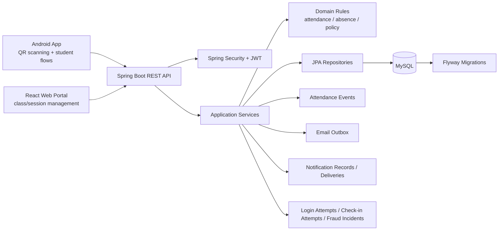

# Attendance Check By QR Code

[](https://github.com/binkadev/Attendance-Check-By-QRcode/actions/workflows/backend-ci.yml)


A production-like classroom attendance platform built around **QR-based check-in**, **role-based class management**, **attendance policy rules**, and **audit-friendly backend workflows**.

This repository contains:

- **Spring Boot backend** for authentication, class/group management, attendance sessions, QR check-in, absence workflows, notifications, fraud/attempt monitoring, and admin security surfaces.
- **React + Vite web portal** for lecturer/admin-style class management screens.
- **Native Android app** for mobile attendance workflows, QR scanning, and API integration.

> **Status note:** This is an academic / portfolio project with substantial implemented scope. It should be described as a **production-like backend/full-stack project**, not as a deployed production system.

---

## Demo

> Recommended before using this repository in a CV/interview: add real screenshots and a short demo video.

| Asset | Status | Suggested content |
|---|---:|---|
| Product demo video | TODO | 2-4 minute walkthrough: login -> class list -> create/open session -> QR scan -> attendance result -> summary |
| Web screenshots | TODO | Dashboard, class management, create class, class detail, attendance history/manual edit |
| Android screenshots | TODO | Login, class list/home timeline, QR scanner, check-in result, attendance history |
| Backend/API screenshots | TODO | Swagger/OpenAPI page, CI pass, selected API response, database migration/test evidence |
| Architecture diagram | Included below | Keep Mermaid diagram or replace with a polished PNG in `docs/architecture/` |

Suggested structure:

```text

docs/
  screenshots/
    web-dashboard.png
    web-class-detail.png
    web-attendance-history.png
    android-class-list.png
    android-qr-scanner.png
    android-checkin-success.png
    swagger-overview.png
    ci-pass.png
  demo/
    attendance-demo.mp4
  architecture/
    system-architecture.png
```

When assets are ready, replace this section with:

```md
## Demo

### Product walkthrough
[Watch demo video](docs/demo/attendance-demo.mp4)

### Screenshots
| Web Portal | Android App | Backend/API |
|---|---|---|
|  |  |  |
```

---

## Table of contents

- [Why this project exists](#why-this-project-exists)
- [What makes this project worth reviewing](#what-makes-this-project-worth-reviewing)
- [System overview](#system-overview)
- [Tech stack](#tech-stack)
- [Repository structure](#repository-structure)
- [Core workflows](#core-workflows)
- [Backend engineering highlights](#backend-engineering-highlights)
- [Web portal](#web-portal)
- [Android app](#android-app)
- [API documentation](#api-documentation)
- [Database design](#database-design)
- [Testing and CI](#testing-and-ci)
- [Run locally](#run-locally)
- [Project scope and honest notes](#project-scope-and-honest-notes)
- [Roadmap](#roadmap)
- [Author](#author)

---

## Why this project exists

Classroom attendance looks simple if it is treated as a CRUD table. In practice, a reliable attendance system needs to handle many domain rules:

- Who can create, update, archive, or manage a class?
- Who can open, close, cancel, or reopen an attendance session?
- When is a QR token valid?
- How should the backend decide between `PRESENT`, `LATE`, `ABSENT`, and `EXCUSED`?
- How should manual attendance corrections be controlled?
- How should absence requests be reviewed, cancelled, approved, and reverted?
- How can suspicious check-in attempts, login abuse, and password reset abuse be monitored?

This project focuses on those backend-heavy engineering concerns while also providing web and Android clients for real product workflows.

---

## What makes this project worth reviewing

This project is not valuable because it has many endpoints. It is valuable because it models a realistic attendance domain where correctness matters.

Key engineering themes:

| Area | What this project demonstrates |
|---|---|
| Domain modeling | Users, classes/groups, members, sessions, QR tokens, attendance records, absence requests, policies, events, notifications, fraud incidents |
| Business rules | Role-aware actions, session state transitions, QR check-in windows, late threshold calculation, manual override restrictions |
| Data integrity | Flyway migrations, relational constraints, unique constraints, check constraints, indexes, and selected trigger-based hardening |
| API contract | OpenAPI 3.0 contract for backend-client integration |
| Security-aware design | JWT authentication, persisted refresh sessions, logout-all support, password reset token tracking, login/password-reset attempt logs |
| Auditability | Attendance events, absence transition tracking, check-in attempt logs, fraud incident management surfaces |
| Full-stack integration | Spring Boot backend, React web portal, Android app, and local Docker/CI support |
| CI discipline | GitHub Actions backend workflow using a MySQL service and Maven test execution |

---

## System overview



### Main actors

| Actor | Main flows |
|---|---|
| Student | Join class, view classes, scan QR, view check-in result, view attendance history, submit absence request |
| Lecturer / Owner | Create class, manage schedules and members, open/close/cancel/reopen sessions, rotate QR, review absence requests, manually correct attendance |
| Co-host | Assist selected teaching/session workflows depending on permissions |
| Admin / operator | Review security overview, login/password-reset abuse surfaces, email outbox state, notification delivery state |

---

## Tech stack

### Backend

| Area | Technology |
|---|---|
| Language | Java 17 |
| Framework | Spring Boot 3.x |
| API | Spring Web REST, OpenAPI 3.0, springdoc-openapi |
| Security | Spring Security, JWT/JJWT |
| Persistence | Spring Data JPA, Hibernate |
| Database | MySQL 8.x |
| Migrations | Flyway |
| Mail | Spring Mail + email outbox model |
| Cache / support infra | Redis-backed infrastructure where configured |
| Testing | JUnit 5, Mockito, Spring Boot Test, MockMvc, Spring Security Test, Testcontainers support |
| Build | Maven Wrapper |
| CI | GitHub Actions |
| Container | Dockerfile + root docker-compose support |

### Web portal

| Area | Technology |
|---|---|
| Framework | React |
| Build tool | Vite |
| Routing | React Router |
| UI support | Tailwind CSS, lucide-react, toast notifications |
| Data visualization | Recharts |
| QR display support | qrcode.react |

### Android app

| Area | Technology |
|---|---|
| Platform | Native Android |
| Language | Java |
| Build | Gradle / Android Gradle Plugin |
| Min SDK | 27 |
| Target SDK | 36 |
| QR scanning | CameraX + Google ML Kit Barcode Scanning |
| API client | Retrofit + Gson |
| UI foundation | AppCompat, Material Components, ConstraintLayout |

---

## Repository structure

```text
.
├── backend springboot/        # Spring Boot backend
│   ├── src/main/java/com/attendance/backend/
│   │   ├── auth/
│   │   ├── group/
│   │   ├── session/
│   │   ├── attendance/
│   │   ├── absence/
│   │   ├── notification/
│   │   ├── fraud/
│   │   ├── adminsecurity/
│   │   ├── me/
│   │   ├── stats/
│   │   ├── mail/
│   │   ├── common/
│   │   └── config/
│   ├── src/main/resources/db/migration/
│   ├── src/main/resources/static/openapi.yaml
│   ├── src/test/java/
│   ├── Dockerfile
│   └── pom.xml
│
├── UniPortalAttendWeb/        # React + Vite web portal
│   ├── src/api/
│   ├── src/components/
│   ├── src/features/
│   │   ├── auth/
│   │   ├── classes/
│   │   ├── dashboard/
│   │   ├── attendance-history/
│   │   ├── legal/
│   │   └── support/
│   └── package.json
│
├── UniPortalAttendApp/        # Native Android app
│   ├── app/src/main/java/com/ptithcm/attendapp/
│   │   ├── api/
│   │   ├── model/
│   │   ├── view/
│   │   └── viewmodel/
│   ├── app/build.gradle
│   └── settings.gradle
│
├── .github/workflows/
│   └── backend-ci.yml
│
└── docker-compose.yml
```

> Repository cleanup note: if `mobile android/` is an old or experimental workspace, consider archiving it or documenting it clearly. Keeping both `UniPortalAttendApp/` and `mobile android/` without explanation can confuse reviewers.

---

## Core workflows

### 1. Authentication and session security

The backend supports:

- Register
- Login
- Refresh access/refresh token
- Logout current session
- Logout all active sessions
- Change password
- Forgot/reset password
- Persisted refresh-session lifecycle
- Login attempt logging
- Password reset attempt logging

The design is intentionally more than simple JWT issuance. Refresh sessions are stored with token hash, device/IP/user-agent metadata, issue/expiry timestamps, last-used timestamp, and revoke metadata.

### 2. Class and membership management

Class/group workflows include:

- Create class/group
- Update class/group information
- Archive or change group status
- Join class by join code
- Member approval flow
- Member actions such as approve, reject, remove, promote, demote, and transfer ownership
- Role model: `OWNER`, `CO_HOST`, `MEMBER`
- Member status model: `PENDING`, `APPROVED`, `REJECTED`, `REMOVED`

Class metadata supports real classroom usage:

- Course code
- Class code
- Semester
- Academic year
- Campus
- Room
- Thumbnail URL
- Start date
- Planned end date
- Weekly schedules
- Total sessions
- Maximum allowed absences

### 3. Schedule validation

The backend includes schedule validation for class creation/update workflows.

It is designed to check active classes whose planned date ranges overlap and report conflicts such as:

- Same lecturer + overlapping day/time
- Same campus/room + overlapping day/time

This is a strong portfolio point because it shows the project handles operational constraints instead of only storing form data.

### 4. Attendance session lifecycle

Attendance sessions are scoped to a group/class.

Supported session operations include:

- Create session
- List sessions by group
- View session detail
- Get currently open session
- Close session
- Cancel session
- Reopen check-in window

Session state includes:

- `OPEN`
- `CLOSED`
- `CANCELLED`

The database and application design also protect against conflicting open-session states.

### 5. QR check-in

The QR workflow is session-scoped.

Main behavior:

- Lecturer/co-host rotates QR token for an active session.
- QR token is returned as plaintext only at rotation time.
- Backend stores token reference/hash information.
- Student submits token + stable device ID through check-in API.
- Backend validates token against the session.
- Backend applies check-in window rules.
- Attendance is recorded as `PRESENT` or `LATE` depending on configured threshold.

Core timing rule:

```text
if now < checkinOpenAt:
    reject as CHECKIN_NOT_OPEN_YET

if now > checkinCloseAt:
    reject as CHECKIN_CLOSED

lateThreshold = checkinOpenAt + lateAfterMinutes

if now <= lateThreshold:
    attendanceStatus = PRESENT
else:
    attendanceStatus = LATE
```

### 6. Manual correction and attendance reset

Manual correction exists, but it is intentionally constrained:

- Only privileged users can manually mark attendance.
- Manual override must be allowed by the session.
- Manual target statuses are limited to `PRESENT`, `LATE`, and `ABSENT`.
- `EXCUSED` is not handled through manual marking; it belongs to the absence request workflow.
- Reset operation clears check-in metadata and returns a record to `ABSENT`.

### 7. Absence request workflow

Absence requests are session-scoped.

Supported behavior:

- Student creates absence request for a session.
- Requester can cancel pending request.
- Owner/co-host can review request.
- Approved request can be reverted.
- Status transitions are protected by application rules and database triggers.

Supported statuses:

- `PENDING`
- `APPROVED`
- `REJECTED`
- `CANCELLED`
- `REVERTED`

### 8. Attendance policy and summary

Attendance policy supports group-level configuration:

- Late weight
- Warning rate threshold
- Critical rate threshold
- Warning absent count
- Critical absent count
- Optional location requirement fields
- Allowed radius in meters

Policy/status APIs support:

- Effective policy lookup
- Upsert/reset custom policy
- Paged student policy status for approved group members
- Current user policy status in a group

Attendance summaries are designed to use closed, non-deleted sessions as the source of truth.

### 9. Notifications

Notification support includes:

- Notification records
- Read/unread state
- Unread count
- Group notification listing
- Notification delivery records
- Delivery channels such as `EMAIL`, `PUSH`, and `WEBSOCKET`
- Delivery status lifecycle such as `PENDING`, `PROCESSING`, `ENQUEUED`, `RETRY`, `DELIVERED`, and `DEAD`
- Rule configuration table for type/channel enablement
- Admin delivery listing/retry API surfaces

> Honest scope note: notification persistence and delivery-state modeling exist, but production-grade delivery reliability should be validated per deployment before claiming it as a complete production notification platform.

### 10. Fraud and attempt monitoring

The backend includes monitoring-oriented tables and APIs:

- Check-in attempt logs
- Attempt outcome/failure code
- Device ID
- IP address
- User agent
- Optional geo fields and distance meter
- Fraud incident records
- Incident severity/status
- Evidence JSON
- Assignment/resolution metadata

> Honest scope note: this should be described as fraud incident tracking / monitoring support, not as advanced autonomous fraud detection.

### 11. Admin security monitoring

Admin security surfaces include:

- Security overview dashboard
- Login abuse sources
- Password reset abuse sources
- Email outbox retry/dead listing

This is useful for showing operational thinking beyond the happy path.

---

## Backend engineering highlights

### Layered backend organization

The backend is organized by domain modules under `com.attendance.backend`, including auth, group, session, attendance, absence, notification, fraud, security, stats, mail, common, and config modules.

### Domain-friendly error model

The project uses an `ApiException` style with HTTP status + business code + message, allowing service logic to return domain-friendly errors such as bad request, unauthorized, forbidden, not found, conflict, unprocessable entity, and too many requests.

### Flyway-first database evolution

Database changes are versioned through Flyway migrations instead of undocumented manual edits.

This matters because attendance systems have many invariants that should be protected at the database level, not only in Java code.

Examples:

- QR tokens linked to sessions
- Refresh token hashes are unique
- Password reset tokens expire after creation
- Attendance sessions support soft-delete via `deleted_at`
- Absence request transitions are trigger-hardened
- Attendance policies enforce valid threshold/range values
- Notification read state is constrained
- Check-in attempt logs enforce failure-code consistency
- Fraud incident resolution state is constrained

### API contract discipline

OpenAPI lives in the repository and documents endpoint groups such as:

- Auth
- Me
- Groups
- Members
- Sessions
- QR
- Attendance
- Absence
- Events
- Notifications
- Fraud
- Admin Security

This helps reviewers understand the system without reading every controller first.

### CI with real database service

Backend CI runs through GitHub Actions with:

- Checkout
- MySQL 8 service
- Database collation setup
- JDK setup
- Maven cache
- Maven test execution
- Surefire report upload

This is a strong signal that the backend is not only manually tested on a local machine.

---

## Web portal

The web portal is built with React + Vite.

Visible source structure includes:

- `src/api/authApi.js`
- `src/api/classApi.js`
- `src/features/auth/pages`
- `src/features/classes`
- `src/features/dashboard/pages`
- `src/features/attendance-history/pages`
- `src/features/legal`
- `src/features/support`

Implemented/represented screens include:

- Login
- Register
- Forgot password
- Reset password
- Dashboard
- Class management
- Create class
- Class detail
- Attendance history / manual edit
- Profile
- Terms of service
- Privacy policy
- Help center

Web stack highlights:

- Route protection using JWT expiry checks
- Local token persistence for development flow
- API wrappers for auth and class/session workflows
- Toast notification support
- QR rendering support through `qrcode.react`
- Charting support through Recharts

> Integration note: some web API calls are currently hardcoded to `http://localhost:8081`. Before deployment or demo recording, move API base URL into environment variables such as `VITE_API_BASE_URL`.

---

## Android app

The Android app is a native Java Android project under `UniPortalAttendApp/`.

Source organization includes:

- `api/`
- `model/`
- `view/`
- `viewmodel/`

Android stack highlights:

- Native Android app module
- Java 11 source compatibility
- CameraX integration
- Google ML Kit barcode scanning
- Retrofit + Gson for backend API integration
- AppCompat / Material Components / ConstraintLayout UI foundation

The Android app should be positioned as the mobile client for QR scanning and student-facing attendance flows.

---

## API documentation

OpenAPI contract:

```text
backend springboot/src/main/resources/static/openapi.yaml
```

Important API groups:

| Group | Example responsibilities |
|---|---|
| Auth | login, register, refresh, logout, logout-all, change password, forgot/reset password |
| Me | current profile, personal classes, class timeline, semesters, notifications, attendance summary |
| Groups | create/update/detail/archive/status, schedule validation |
| Members | join group, list members, approve/reject/remove/promote/demote/transfer ownership |
| Sessions | create/list/history/open/detail/close/cancel |
| QR | rotate session QR token |
| Attendance | QR check-in, reopen check-in, manual mark, reset, attendance list, summaries, policy status |
| Absence | create/list/detail/review/cancel/revert absence requests |
| Events | session/group attendance events |
| Notifications | personal notifications, delivery admin APIs |
| Fraud | fraud incident list/detail/update |
| Admin Security | security overview, login abuse, password reset abuse, email outbox monitoring |

---

## Database design

Flyway migration location:

```text
backend springboot/src/main/resources/db/migration
```

### Core tables

- `users`
- `class_groups`
- `group_members`
- `attendance_sessions`
- `session_attendance`
- `absence_requests`
- `attendance_events`

### Extended tables

- `qr_tokens`
- `user_sessions`
- `password_reset_tokens`
- `password_reset_attempts`
- `login_attempts`
- `email_outbox`
- `attendance_policies`
- `notifications`
- `notification_deliveries`
- `notification_rule_configs`
- `checkin_attempt_logs`
- `fraud_incidents`
- `group_weekly_schedules`

### Key relationships

| Relationship | Design intent |
|---|---|
| `users -> group_members -> class_groups` | Membership and role/state access control |
| `class_groups -> attendance_sessions` | Sessions belong to a class/group |
| `attendance_sessions -> session_attendance` | Attendance rows are scoped to a session/user pair |
| `attendance_sessions -> qr_tokens` | QR token rotation/validation remains session-bound |
| `absence_requests -> session_attendance` | Approved absence maps to attendance exception handling |
| `notifications -> notification_deliveries` | Notification content is separated from channel delivery lifecycle |
| `checkin_attempt_logs -> fraud_incidents` | Attempt telemetry supports incident-level monitoring |

### Integrity techniques used

- Foreign keys
- Unique constraints
- Check constraints
- Indexed query paths
- Soft-delete fields where needed
- Trigger-based workflow hardening for selected absence/event flows

---

## Testing and CI

Test source:

```text
backend springboot/src/test/java
```

Test resources:

```text
backend springboot/src/test/resources/application-test.yml
backend springboot/src/test/resources/sql
```

Representative tested areas:

- Controller/API behavior with MockMvc
- Service/domain behavior
- Attendance read/summary logic
- Session behavior
- Group behavior
- Absence workflow behavior
- Admin security aggregation
- Application context loading with test profile

Run backend tests:

```bash
cd "backend springboot"
./mvnw test
```

Windows PowerShell:

```powershell
cd "backend springboot"
./mvnw.cmd test
```

---

## Run locally

### Prerequisites

- JDK 17+
- MySQL 8.x
- Maven Wrapper
- Node.js / npm for the React web portal
- Android Studio for the Android app
- Redis if running modules that depend on Redis-backed infrastructure

### 1. Clone repository

```bash
git clone https://github.com/binkadev/Attendance-Check-By-QRcode.git
cd Attendance-Check-By-QRcode
```

### 2. Create local database

```sql
CREATE DATABASE attendance_dev
  CHARACTER SET utf8mb4
  COLLATE utf8mb4_unicode_ci;
```

Update local datasource settings according to your active Spring profile.

### 3. Run backend

Linux/macOS:

```bash
cd "backend springboot"
./mvnw spring-boot:run -Pdev
```

Windows PowerShell:

```powershell
cd "backend springboot"
./mvnw.cmd spring-boot:run -Pdev
```

> Note: `backend springboot` contains a space, so keep quotes around the path in shell commands.

### 4. Run web portal

```bash
cd UniPortalAttendWeb
npm install
npm run dev
```

Before demo/deployment, configure API base URL through environment variables instead of hardcoded localhost values.

### 5. Run Android app

Open `UniPortalAttendApp/` in Android Studio, sync Gradle, then run the `app` module on an emulator or physical device.

CLI build example:

```bash
cd UniPortalAttendApp
./gradlew assembleDebug
```

Windows PowerShell:

```powershell
cd UniPortalAttendApp
./gradlew.bat assembleDebug
```

---

## Docker

Backend Dockerfile:

```text
backend springboot/Dockerfile
```

Build backend image:

```bash
cd "backend springboot"
docker build -t attendance-backend:local .
```

Run backend container:

```bash
docker run --rm -p 8081:8081 attendance-backend:local
```

> Runtime connectivity still depends on external services such as MySQL and Redis according to the active profile configuration.

---

## Project scope and honest notes

### Strongly represented in source

- Spring Boot REST backend
- MySQL schema managed by Flyway
- OpenAPI contract
- JWT authentication and refresh-session persistence
- Class/group/member workflows
- Schedule metadata and conflict validation API surface
- Attendance session lifecycle
- QR check-in workflow
- Manual attendance correction
- Absence request workflow
- Attendance policy surfaces
- Notification persistence/delivery-state modeling
- Login/password-reset/check-in attempt monitoring tables
- Fraud incident management surfaces
- GitHub Actions backend CI
- React web portal source
- Android app source with QR scanning dependencies

### Describe carefully

- This is production-like, not a deployed production system.
- Notification delivery should be described as infrastructure/API support unless verified in a deployed environment.
- Fraud support should be described as monitoring/incident-management support, not advanced autonomous fraud detection.
- Scalability claims should be backed by load tests before stating specific numbers.

### Known integration / cleanup items

- Align fraud incident type values across OpenAPI, backend code, and database constraints.
- Verify web profile update endpoint alignment with the backend current-user profile endpoint.
- Move frontend API base URLs to environment variables.
- Add screenshots and demo video before using this README for CV/recruiter review.
- Clarify or archive duplicate/legacy mobile workspace if `mobile android/` is no longer the primary app.

---

## Roadmap

- Add polished product screenshots and demo video
- Add an ER diagram or database relationship diagram
- Add deployment environment documentation
- Add frontend `.env.example`
- Add Android setup notes for emulator/local backend access
- Align OpenAPI/backend/database enum values for fraud incidents
- Expand end-to-end tests around notification delivery
- Add more edge-case and concurrency tests for QR check-in/session workflows
- Add observability notes such as logs, metrics, or tracing plan

---

## Author

**binkadev**  
PTIT D22

---

## Reviewer note

For recruiters and backend reviewers: the strongest part of this project is the backend engineering judgment behind the attendance domain — session-scoped QR validation, role-aware workflows, state transitions, Flyway-based data integrity, audit/monitoring surfaces, and database-aware CI — with web and Android clients showing how the backend can support real product flows.
