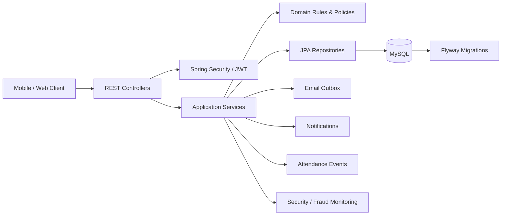

# Attendance Check By QR Code

[](https://github.com/binkadev/Attendance-Check-By-QRcode/actions/workflows/backend-ci.yml)


> Production-like Spring Boot backend for QR-based classroom attendance management.  
> The project focuses on business-rule correctness, database integrity, API contract clarity, and testable backend workflows.

**Status:** Academic / portfolio backend project. Around 90% of the initial scope is implemented. This repository should be described as a **production-like backend**, not a deployed production system.

---

## Table of contents

- [Why this project exists](#why-this-project-exists)
- [What this backend demonstrates](#what-this-backend-demonstrates)
- [Core capabilities](#core-capabilities)
- [Tech stack](#tech-stack)
- [Architecture](#architecture)
- [Main modules](#main-modules)
- [Selected business rules](#selected-business-rules)
- [API documentation](#api-documentation)
- [Database and Flyway design](#database-and-flyway-design)
- [Testing and CI](#testing-and-ci)
- [Run locally](#run-locally)
- [Docker](#docker)
- [Project scope and honest notes](#project-scope-and-honest-notes)
- [Roadmap](#roadmap)
- [Author](#author)

---

## Why this project exists

Classroom attendance looks simple at first, but a reliable backend needs more than CRUD records.

A real attendance workflow must answer questions such as:

- Who is allowed to create, open, close, or modify an attendance session?
- When is a QR check-in valid?
- Should a student be marked `PRESENT`, `LATE`, `ABSENT`, or `EXCUSED`?
- How are manual corrections controlled and audited?
- How should absence requests be reviewed and reverted?
- How can suspicious check-in attempts or account-abuse signals be monitored?

This project models those concerns as backend rules, database constraints, API contracts, and automated tests.

---

## What this backend demonstrates

From a backend engineering perspective, this project is designed to show:

| Area                             | What the project demonstrates                                                                                        |
| -------------------------------- | -------------------------------------------------------------------------------------------------------------------- |
| Domain modeling                  | Groups/classes, members, sessions, attendance records, absence requests, policies, notifications, fraud incidents    |
| Business rules                   | Role-based actions, session state transitions, QR check-in windows, late calculation, manual override restrictions   |
| Data integrity                   | Flyway migrations, foreign keys, unique constraints, check constraints, indexed query paths, trigger-based hardening |
| Security-oriented backend design | JWT auth, refresh-session persistence, password reset tokens, login/password-reset attempt logs                      |
| API contract discipline          | OpenAPI 3.0 contract grouped by domain modules                                                                       |
| Testability                      | Unit/controller tests and Spring Boot integration-style tests with MockMvc/test profile                              |
| CI readiness                     | GitHub Actions workflow running backend tests with a MySQL service                                                   |

---

## Core capabilities

### Authentication and account security

- Register and login
- JWT-based authentication
- Refresh token flow backed by persisted user sessions
- Logout current session and logout all sessions
- Change password
- Forgot/reset password flow
- Login and password-reset attempt logging for security monitoring

### Class / group management

- Create, update, view, archive, and change status of class groups
- Group ownership model
- Member roles: `OWNER`, `CO_HOST`, `MEMBER`
- Member states: `PENDING`, `APPROVED`, `REJECTED`, `REMOVED`
- Join group by join code
- Approve, reject, remove, promote, demote, and transfer ownership flows
- Academic metadata such as semester, academic year, course code, class code, campus, and room
- Weekly schedule metadata and group-level limits such as total sessions and maximum allowed absences

### Mobile-oriented self-read APIs

- Current user profile
- Class list endpoint for mobile class screens
- Search and filter support for visible classes
- Semester / academic-year dropdown support
- Personal attendance summary
- Personal absence request list
- Personal notification list and unread count

### Attendance session workflow

- Create attendance sessions for a group
- Open session lookup
- Close, cancel, and reopen check-in windows
- Session statuses: `OPEN`, `CLOSED`, `CANCELLED`
- Soft-delete support for sessions
- Session attendance list and individual attendance records

### QR attendance

- Rotate QR token for a live attendance session
- Return plaintext QR token only at rotation time
- Persist token reference/hash information
- Validate QR token against the target session
- Apply check-in window rules
- Mark attendance as `PRESENT` or `LATE` based on configured threshold

### Manual attendance correction

- Manual mark attendance as `PRESENT`, `LATE`, or `ABSENT`
- Reset attendance back to `ABSENT`
- Restrict manual override by session settings and user role
- Keep attendance events for audit-style visibility
- Keep `EXCUSED` separate from manual override and route it through absence workflow

### Absence request workflow

- Student submits a session-scoped absence request
- Owner/co-host reviews the request
- Supported states: `PENDING`, `APPROVED`, `REJECTED`, `CANCELLED`, `REVERTED`
- Approved absence can be reverted by privileged users
- Database hardening prevents invalid mutable workflows

### Attendance policy

- Configure group-level attendance policy
- Late weight configuration
- Warning and critical thresholds by attendance rate and absence count
- Query effective policy
- Query each student’s policy status
- Query the current user’s policy status in a group

### Notifications

- Notification persistence
- Read/unread user APIs
- Unread count endpoint
- Group notification listing
- Delivery state tracking model
- Notification rule configuration model
- Admin delivery listing and retry API surfaces

### Fraud and monitoring support

- Check-in attempt logs
- Fraud incident records
- Fraud incident list/detail/update API surfaces
- Admin security overview for login abuse, password reset abuse, and email outbox state

> Fraud and notification delivery are best described as **infrastructure and API surfaces**. They should not be presented as a fully mature autonomous fraud-detection or production notification platform yet.

---

## Tech stack

| Area                       | Technology                                   |
| -------------------------- | -------------------------------------------- |
| Language                   | Java 17                                      |
| Framework                  | Spring Boot 3.x                              |
| API                        | Spring Web REST, OpenAPI 3.0                 |
| Security                   | Spring Security, JWT/JJWT                    |
| Persistence                | Spring Data JPA, Hibernate                   |
| Database                   | MySQL                                        |
| Migrations                 | Flyway                                       |
| Cache / rate-limit support | Redis-backed infrastructure where configured |
| Mail                       | Spring Mail + email outbox model             |
| Build                      | Maven Wrapper                                |
| Testing                    | JUnit 5, Mockito, Spring Boot Test, MockMvc  |
| Container                  | Docker multi-stage backend image             |
| CI                         | GitHub Actions                               |

---

## Architecture

The backend follows a layered architecture with domain-oriented modules.



### Layer responsibilities

| Layer          | Responsibility                                                                         |
| -------------- | -------------------------------------------------------------------------------------- |
| Controller     | Expose `/api/v1/**` endpoints, validate request shape, resolve authenticated principal |
| Service        | Execute use cases, enforce authorization-aware business rules, coordinate persistence  |
| Repository     | Encapsulate JPA queries and database access                                            |
| Domain / model | Represent entities, enums, statuses, and policy concepts                               |
| Database       | Enforce relational integrity, constraints, indexes, and migration-based hardening      |
| OpenAPI        | Document request/response contracts and API groups                                     |

---

## Main modules

| Module            | Responsibility                                                                        |
| ----------------- | ------------------------------------------------------------------------------------- |
| Auth              | Login, register, refresh, logout, password change/reset, session tracking             |
| Me                | Current user profile, personal class list, attendance summary, personal notifications |
| Groups            | Class/group lifecycle, metadata, archive/status flows                                 |
| Members           | Join group, approval flow, role management, ownership transfer                        |
| Sessions          | Attendance session creation, open lookup, close/cancel/reopen workflows               |
| QR                | QR token rotation and session-scoped token validation                                 |
| Attendance        | QR check-in, manual correction, reset, summaries                                      |
| Absence           | Student absence request lifecycle and review/revert operations                        |
| Events            | Attendance event history for audit-style visibility                                   |
| Attendance Policy | Group policy configuration and warning/critical status calculation surfaces           |
| Notifications     | Notification records, read state, delivery tracking, rule configuration               |
| Fraud / Attempts  | Check-in attempt logs and fraud incident management surfaces                          |
| Admin Security    | Login abuse, password reset abuse, and email outbox monitoring APIs                   |

---

## Selected business rules

### Role-based access

- Group owners can perform privileged group operations.
- Co-hosts can perform selected teaching/session workflows.
- Members have limited self-read and participation actions.
- Some operations require approved membership, not just authentication.

### QR check-in window

- Reject check-in before `checkinOpenAt`.
- Reject check-in after `checkinCloseAt`.
- Use `checkinOpenAt + lateAfterMinutes` as the late threshold.
- Check-in at or before the late threshold becomes `PRESENT`.
- Check-in after the late threshold but before close becomes `LATE`.
- QR token must belong to the same attendance session.

### Attendance session lifecycle

- Sessions move through `OPEN`, `CLOSED`, and `CANCELLED` states.
- The backend prevents invalid actions based on session state.
- The database and application are designed around the rule that a group should not have multiple open sessions at the same time.

### Manual override rules

- Manual override is allowed only when the session permits it.
- Manual override supports `PRESENT`, `LATE`, and `ABSENT`.
- `EXCUSED` is intentionally handled through the absence request workflow.
- Repeating the same manual status can be treated as a no-op instead of creating noisy audit records.

### Absence request rules

- New absence requests are session-scoped.
- Pending requests can be approved, rejected, or cancelled.
- Approved requests can be reverted by privileged users.
- Terminal states are protected from invalid transitions.

### Attendance summary rules

- Attendance summary is based on recorded session attendance.
- Closed, non-deleted sessions are treated as the reliable source for summary-style calculations.
- Open or cancelled sessions should not be counted as final attendance history.

---

## API documentation

OpenAPI contract:

```text
backend springboot/src/main/resources/static/openapi.yaml
```

API groups include:

| Group             | Examples                                                                                          |
| ----------------- | ------------------------------------------------------------------------------------------------- |
| Auth              | `/auth/login`, `/auth/refresh`, `/auth/logout`, `/auth/reset-password`                            |
| Me                | `/me`, `/me/classes`, `/me/attendance/summary`, `/me/notifications`                               |
| Groups            | `/groups`, `/groups/{groupId}`, `/groups/{groupId}/status`                                        |
| Members           | `/groups/join`, `/groups/{groupId}/members`                                                       |
| Sessions          | `/groups/{groupId}/sessions`, `/sessions/{sessionId}/close`, `/sessions/{sessionId}/cancel`       |
| QR                | `/sessions/{sessionId}/qr/rotate`                                                                 |
| Attendance        | `/sessions/{sessionId}/checkin/qr`, `/sessions/{sessionId}/attendance`                            |
| Absence           | `/groups/{groupId}/absence-requests`, `/absence-requests/{requestId}/review`                      |
| Events            | `/sessions/{sessionId}/attendance-events`, `/groups/{groupId}/events`                             |
| Attendance Policy | `/groups/{groupId}/attendance-policy`, `/groups/{groupId}/attendance-policy/students`             |
| Notifications     | `/me/notifications`, `/admin/notification-deliveries`                                             |
| Fraud             | `/groups/{groupId}/fraud-incidents`                                                               |
| Admin Security    | `/admin/security/overview`, `/admin/security/login-abuse`, `/admin/security/password-reset-abuse` |

### Contract alignment note

There is a known contract-alignment item around fraud incident type values between OpenAPI and database/backend constraints. This should be reconciled before exposing the fraud incident API to external consumers.

---

## Database and Flyway design

Flyway migrations live under:

```text
backend springboot/src/main/resources/db/migration
```

### Core domain tables

- `users`
- `class_groups`
- `group_members`
- `attendance_sessions`
- `session_attendance`
- `absence_requests`
- `attendance_events`

### Extended backend tables

- `qr_tokens`
- `user_sessions`
- `password_reset_tokens`
- `password_reset_attempts`
- `login_attempts`
- `email_outbox`
- `attendance_policies`
- `notifications`
- `notification_deliveries`
- `notification_rule_configs`
- `checkin_attempt_logs`
- `fraud_incidents`
- `group_weekly_schedules`

### Integrity techniques used

- Foreign keys for relationship safety
- Unique constraints for domain invariants
- Check constraints for valid state/range values
- Indexes for common query paths
- Trigger-based hardening for selected workflows
- Migration-based schema evolution instead of ad-hoc database edits

---

## Testing and CI

Test sources live under:

```text
backend springboot/src/test/java
```

Test configuration examples:

```text
backend springboot/src/test/resources/application-test.yml
backend springboot/src/test/resources/sql
```

### Test types

- Unit tests for service/domain-style logic
- Controller tests with MockMvc
- Spring Boot integration-style tests using the test profile
- Database-aware CI test execution with MySQL service

### Run tests locally

```bash
cd "backend springboot"
./mvnw test
```

For Windows PowerShell:

```powershell
cd "backend springboot"
./mvnw.cmd test
```

### GitHub Actions CI

Workflow:

```text
.github/workflows/backend-ci.yml
```

The CI workflow is designed to:

- Run on push and pull request
- Start a MySQL 8 service
- Prepare database collation
- Set up JDK and Maven cache
- Run the backend Maven test suite
- Upload Surefire test reports as artifacts

---

## Run locally

### Prerequisites

- JDK 17+
- Maven or Maven Wrapper
- MySQL 8.x
- Redis if running features that depend on Redis-backed infrastructure

### Clone repository

```bash
git clone https://github.com/binkadev/Attendance-Check-By-QRcode.git
cd Attendance-Check-By-QRcode
```

### Configure database

Create a MySQL database for your local profile and update datasource credentials if needed in:

```text
backend springboot/src/main/resources/application.yml
backend springboot/src/main/resources/application-dev.yml
backend springboot/src/test/resources/application-test.yml
```

### Start backend

```bash
cd "backend springboot"
./mvnw spring-boot:run -Pdev
```

For Windows PowerShell:

```powershell
cd "backend springboot"
./mvnw.cmd spring-boot:run -Pdev
```

> The backend directory name contains a space: `backend springboot`. Keep quotes around the path in shell commands.

---

## Docker

Backend Dockerfile:

```text
backend springboot/Dockerfile
```

Build image:

```bash
cd "backend springboot"
docker build -t attendance-backend:local .
```

Run container:

```bash
docker run --rm -p 8081:8081 attendance-backend:local
```

> Runtime connectivity still depends on external services such as MySQL and Redis according to the active profile configuration.

---

## Project scope and honest notes

This repository is strongest as a backend engineering portfolio project. It is intentionally described as **production-like**, not as a deployed production system.

### Implemented / visible in source

- Spring Boot REST backend
- OpenAPI contract
- MySQL schema managed by Flyway
- QR session check-in flow
- Group/member/session/attendance/absence workflows
- Attendance policy tables and API surfaces
- Notification tables and API surfaces
- Fraud incident and check-in attempt monitoring surfaces
- Security monitoring tables and admin API surfaces
- GitHub Actions backend CI workflow

### Describe carefully

- Notification delivery should be described as infrastructure/API support unless deployment-level delivery behavior is verified.
- Fraud support should be described as monitoring/incident-management support, not advanced autonomous fraud detection.
- Deployment hardening should not be claimed as production-complete.

### Known alignment item

- Fraud incident type values should be aligned between OpenAPI and database/backend constraints before external API consumers rely on that contract.

---

## Roadmap

- Align fraud incident enum values across OpenAPI, backend code, and database constraints
- Expand end-to-end tests for notification delivery workflows
- Add more edge-case tests for role transitions, session state transitions, and concurrent check-ins
- Improve deployment documentation and environment matrix
- Add observability support such as metrics, tracing, and structured dashboards
- Add richer API examples for recruiter/reviewer-friendly documentation

---

## Author

**binkadev**  
PTIT D22

---

## Reviewer note

This project is not valuable because it has many endpoints. It is valuable because it models a realistic backend domain where correctness matters: role-based permissions, state transitions, QR token validity, attendance policy rules, database constraints, audit-style events, and CI-tested API behavior.
