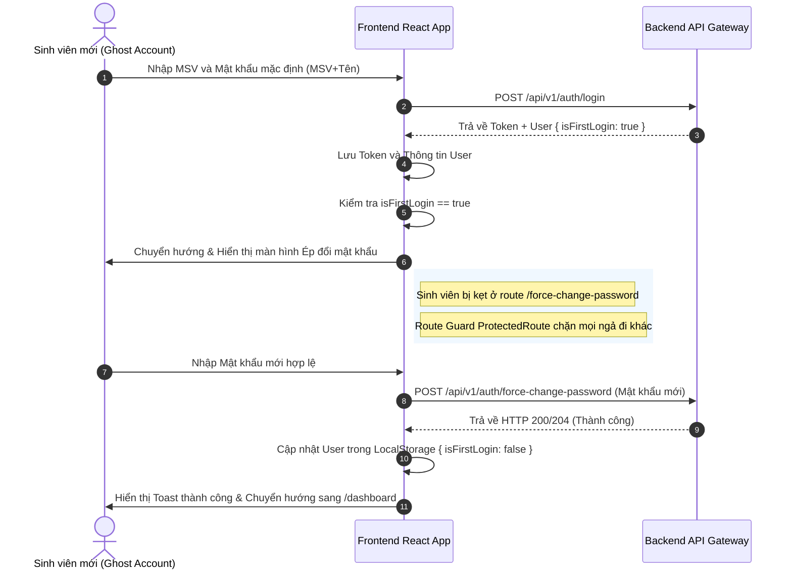

# Báo cáo Phân tích Khớp nối & Kế hoạch Tích hợp 2 API Mới
> [!NOTE]
> Tài liệu này đánh giá hiện trạng mã nguồn của dự án **UniPortalAttendWeb** đối chiếu với **2 API mới** được cập nhật bởi đội ngũ Backend, từ đó chỉ ra những phần đã hoàn thiện, điểm cần hiệu chỉnh nhỏ và các thiếu sót quan trọng cần bổ sung để hệ thống hoạt động trơn tru.

---

## Tổng quan Đánh giá nhanh
Hệ thống Frontend hiện tại của bạn đã được thiết kế **rất bài bản và tiệm cận với đặc tả API mới**. Đặc biệt, luồng **Import Sinh viên** gần như đã khớp hoàn toàn nhờ bộ giả lập 12 quy tắc nghiệp vụ và giao diện Wizard 3 bước cực kỳ cao cấp. 

Tuy nhiên, đối với luồng **Ép đổi mật khẩu (Force Password Change)**, Frontend hiện tại đang có **khoảng trống lớn (Gap)** vì hoàn toàn chưa có giao diện, chưa có API service tương ứng và chưa có bộ lọc Route Guard bảo vệ, cho phép tài khoản Ghost Account vượt qua màn hình đăng nhập đi thẳng vào Dashboard.

Dưới đây là chi tiết phân tích từng phần và giải pháp cụ thể.

---

## 1. Đánh giá tính năng Import danh sách hàng loạt
**API Backend:** `POST /api/v1/groups/{groupId}/members/import` (group-member-controller)

### 📊 Bảng đối chiếu hiện trạng
| Thành phần | Hiện trạng trong Code Frontend | Mức độ tương thích | Đánh giá & Khuyến nghị |
| :--- | :--- | :---: | :--- |
| **API Client (`classApi.js`)** | Đã viết hàm `validateImportMembers` và `importMembers` hướng tới endpoint `/api/v1/groups/{groupId}/members/import`. | **100%** | Chuẩn xác theo cấu trúc thiết kế một endpoint duy nhất của Backend. |
| **Cấu trúc dữ liệu gửi đi** | Gửi mảng `members` dạng JSON chứa `{ rowIndex, studentCode, fullName, email }`. | **100%** | Đã đồng bộ với cấu trúc đầu vào của BE. |
| **Luồng Wizard 3 bước (`StudentsTab.jsx`)** | Đã tích hợp gọi API thật ở bước dry-run (Validate) và commit (Import). Tự động fallback sang giả lập local nếu API lỗi. | **95%** | Cần kiểm tra cấu trúc phản hồi thực tế của BE để gán trạng thái phù hợp. |
| **Xử lý xung đột chéo (Rule 6)** | Đã cài đặt cờ `hasCriticalConflict` giúp chặn nút submit và cảnh báo đỏ toàn bộ nếu phát hiện xung đột. | **100%** | Đảm bảo tính an toàn dữ liệu và đồng bộ nghiệp vụ của hệ thống. |

### ⚠️ Điểm cần lưu ý & Kiểm chuẩn (Alignment)
1. **Định dạng Wrapper của API:**
   Trong `classApi.js` (dòng 193-236), payload đang được bọc trong một đối tượng cấu hình:
   ```json
   {
     "importMode": "VALIDATE_ONLY",
     "syncMode": "APPEND_ONLY",
     "accountProvisioningMode": "CREATE_REQUIRE_PASSWORD_CHANGE",
     "notifyStudents": true,
     "members": [ ... ]
   }
   ```
   > [!IMPORTANT]
   > Hãy xác nhận với Backend xem họ viết Controller nhận **đúng đối tượng Wrapper** này hay chỉ nhận trực tiếp **mảng JSON phẳng** `[ {studentCode, fullName, email} ]`. Nếu Backend chỉ nhận mảng phẳng, chúng ta cần loại bỏ các trường bọc ngoài trong `classApi.js`.
   
2. **Khớp mã Action/Status của dòng:**
   Giao diện Step 2 hiển thị các nhãn màu dựa trên trường `row.action` hoặc `row.status` trả về từ Backend (ví dụ: `CREATED_USER_AND_ADDED`, `LINKED_EXISTING_USER_AND_ADDED`, ...). Cần đảm bảo chuỗi String Backend trả về khớp 100% với các mã này trên Client để tránh bị hiển thị thành "Lỗi dữ liệu".

---

## 2. Đánh giá luồng Ép đổi mật khẩu (Force Password Change)
**API Backend:** `POST /api/v1/auth/force-change-password` (auth-controller)

> [!CAUTION]
> **KHOẢNG TRỐNG QUAN TRỌNG (CRITICAL GAP):**
> 1. API Client (`authApi.js`) hoàn toàn **chưa khai báo** hàm gọi API này.
> 2. Màn hình Đăng nhập (`Login.jsx`) **chưa kiểm tra** cờ `isFirstLogin` từ phản hồi của API Đăng nhập và đang cho phép chuyển hướng thẳng vào `/dashboard`.
> 3. Route Guard (`App.jsx` - `ProtectedRoute`) **chưa chặn** người dùng có trạng thái đăng nhập lần đầu, khiến họ có thể gõ trực tiếp URL để vượt qua.
> 4. Dự án **chưa có trang** `/force-change-password` để sinh viên thực hiện đổi mật khẩu.

---

## Kế hoạch Triển khai & Khớp nối Code Chi tiết
Để đáp ứng trọn vẹn và an toàn luồng Ép đổi mật khẩu mà Backend vừa bổ sung, chúng ta sẽ thực hiện 4 bước sửa đổi sau:

### BƯỚC 1: Bổ sung API Service vào `authApi.js`
Thêm hàm `forceChangePassword` sử dụng token được cấp tạm thời từ localStorage để gọi API đổi mật khẩu chuyên dụng cho tài khoản Ghost.

```diff
// src/api/authApi.js
  // ==========================================
  // 5. API ĐỔI MẬT KHẨU THƯỜNG
  // ==========================================
  changePassword: async (payload) => {
    ...
  },

+ // ==========================================
+ // 5b. API ÉP ĐỔI MẬT KHẨU (CHO GHOST ACCOUNT ĐĂNG NHẬP LẦN ĐẦU)
+ // ==========================================
+ forceChangePassword: async (payload) => {
+   try {
+     const response = await fetch(`${BASE_URL}/force-change-password`, {
+       method: 'POST',
+       headers: {
+         'Content-Type': 'application/json',
+         'Authorization': `Bearer ${localStorage.getItem('accessToken')}`
+       },
+       body: JSON.stringify(payload), // { currentPassword: 'MSV+Ten', newPassword: '...' }
+     });
+ 
+     if (response.status === 204 || response.ok) {
+       return true;
+     }
+ 
+     const data = await response.json().catch(() => ({}));
+     throw new Error(data.message || 'Lỗi khi yêu cầu ép đổi mật khẩu');
+   } catch (error) {
+     throw error;
+   }
+ },
```

---

### BƯỚC 2: Cập nhật kiểm tra luồng đăng nhập trong `Login.jsx`
Chặn chuyển hướng đến `/dashboard` nếu tài khoản đăng nhập trả về cờ `isFirstLogin = true` (hoặc `requirePasswordChange = true`) và hướng tới trang đổi mật khẩu bắt buộc.

```diff
// src/features/auth/pages/Login.jsx (dòng 51-68)
      const response = await authApi.login(payload);

      if (rememberMe) {
        localStorage.setItem('rememberedEmail', formData.email);
      } else {
        localStorage.removeItem('rememberedEmail');
      }

      localStorage.setItem('accessToken', response.accessToken);
      localStorage.setItem('refreshToken', response.refreshToken);
      localStorage.setItem('user', JSON.stringify(response.user));

      toast.success(t('login.toast_success'), { id: loadingToastId });
      
-     setTimeout(() => {
-       navigate('/dashboard');
-     }, 500);
+     setTimeout(() => {
+       // Kiểm tra xem đây có phải là lần đăng nhập đầu tiên của Ghost Account không
+       if (response.user?.isFirstLogin || response.user?.requirePasswordChange) {
+         toast.success("Tài khoản của bạn cần đổi mật khẩu mặc định trước khi sử dụng!", { duration: 4000 });
+         navigate('/force-change-password');
+       } else {
+         navigate('/dashboard');
+       }
+     }, 500);
```

---

### BƯỚC 3: Thiết lập Route Guard an toàn trong `App.jsx`
Ngăn chặn người dùng cố tình gõ tay `/dashboard` trên thanh địa chỉ để trốn đổi mật khẩu.

```diff
// src/App.jsx (dòng 42-54)
// Component bảo vệ các trang yêu cầu đăng nhập (Chặn khách)
const ProtectedRoute = ({ children }) => {
  const token = localStorage.getItem('accessToken');
+ const user = JSON.parse(localStorage.getItem('user') || '{}');
  
  if (!token || !isTokenValid(token)) {
    // Xóa rác nếu token hết hạn
    localStorage.removeItem('accessToken');
    localStorage.removeItem('refreshToken');
    localStorage.removeItem('user');
    return <Navigate to="/login" replace />;
  }
  
+ // NẾU LÀ GHOST ACCOUNT CHƯA ĐỔI MẬT KHẨU -> BẮT BUỘC ĐẨY VÀO TRANG ĐỔI MẬT KHẨU
+ if (user.isFirstLogin || user.requirePasswordChange) {
+   return <Navigate to="/force-change-password" replace />;
+ }
  
  return children;
};
```

Đồng thời cấu hình Route Guard cho riêng trang `/force-change-password` để ngăn người dùng bình thường truy cập:
```javascript
// Thêm vào src/App.jsx
const ForceChangePasswordRoute = ({ children }) => {
  const token = localStorage.getItem('accessToken');
  const user = JSON.parse(localStorage.getItem('user') || '{}');
  
  if (!token || !isTokenValid(token)) {
    return <Navigate to="/login" replace />;
  }
  
  // Nếu đã đổi mật khẩu thành công rồi thì đẩy về dashboard
  if (!user.isFirstLogin && !user.requirePasswordChange) {
    return <Navigate to="/dashboard" replace />;
  }
  
  return children;
};
```

---

### BƯỚC 4: Tạo mới trang Ép đổi mật khẩu với giao diện Premium
Được thiết kế tinh tế với phong cách tối giản, mượt mà và trực quan để "WOW" sinh viên ngay lần đầu đăng nhập.

#### `[NEW]` [ForceChangePassword.jsx](file:///home/phupv/mycode/UniPortalAttendWeb/src/features/auth/pages/ForceChangePassword.jsx)
Trang web này sẽ bao gồm:
* Biểu mẫu nhập Mật khẩu Hiện tại (mặc định) & Mật khẩu Mới & Xác nhận.
* Thanh đánh giá độ mạnh yếu của mật khẩu mới theo thời gian thực (Real-time Password Strength Meter).
* Banner hướng dẫn tinh tế chỉ ra tài khoản Ghost Account là gì và tại sao họ cần đổi mật khẩu.
* Tự động cập nhật lại cờ `isFirstLogin = false` trong LocalStorage của User khi đổi mật khẩu thành công để mở khóa chuyển tiếp về Dashboard.

---

## 📈 Sơ đồ Quy trình Hoạt động của Luồng Mới (Ghost Account Flow)



---

## Ý kiến phản hồi & Xác nhận từ Bạn
Bạn hãy xem qua bản phân tích khoảng trống kỹ thuật này. 
- **Bạn có muốn tôi tiến hành thực hiện viết code bổ sung trang `ForceChangePassword.jsx` và cập nhật các tệp liên quan (`authApi.js`, `Login.jsx`, `App.jsx`) theo đúng kế hoạch trên không?**
- Hãy cho tôi biết nếu bạn có bất kỳ sửa đổi hoặc yêu cầu đặc biệt nào về giao diện hay logic nhé!
