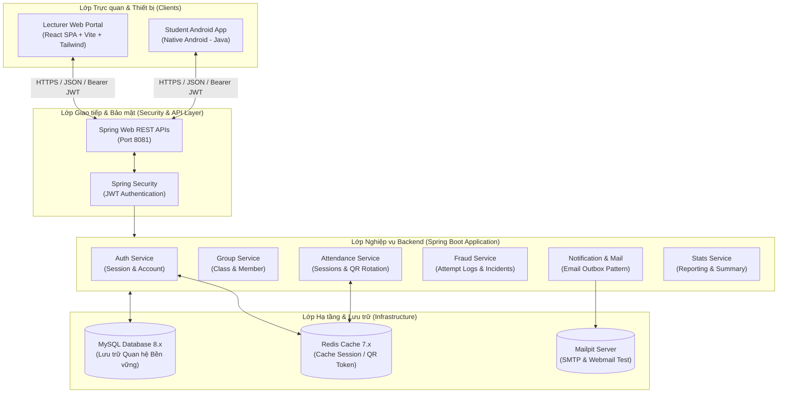
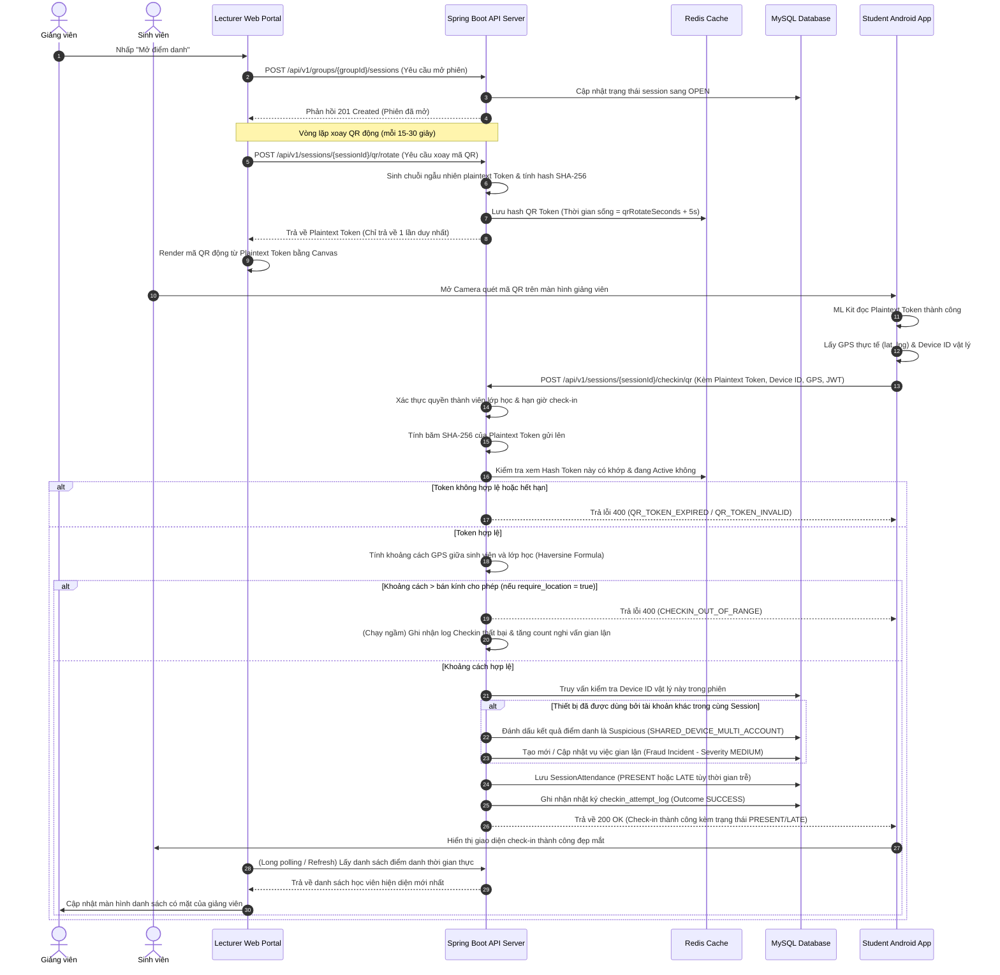

# CHƯƠNG 3. KIẾN TRÚC HỆ THỐNG

Chương này trình bày chi tiết về kiến trúc hệ thống điểm danh bằng mã QR động (Attendance Check By QR Code). Hệ thống được thiết kế theo hướng thực tiễn (production-ready) với sự tách biệt rõ ràng giữa các thành phần client và sự chặt chẽ của các quy tắc nghiệp vụ tại backend, nhằm đảm bảo tính toàn vẹn dữ liệu, khả năng chịu tải cao, tính bảo mật và ngăn chặn gian lận điểm danh.

---

## 3.1. Kiến trúc tổng thể Hướng dịch vụ (SOA)

Hệ thống điểm danh được xây dựng dựa trên nguyên lý của **Kiến trúc hướng dịch vụ (Service-Oriented Architecture - SOA)**, phân rã thành ba thành phần chính chạy độc lập và giao tiếp trực tiếp với nhau thông qua mạng dựa trên giao thức RESTful API.



### Các thành phần chính trong kiến trúc tổng thể:
1. **Lecturer Web Portal (React Single Page Application)**: Dành cho giảng viên quản lý lớp học, cấu hình lịch trình học tập, mở phiên điểm danh, hiển thị mã QR xoay vòng thời gian thực, duyệt đơn xin nghỉ phép của sinh viên và theo dõi các trường hợp cảnh báo gian lận.
2. **Student Android App (Native Android)**: Dành cho sinh viên quét mã QR điểm danh nhanh, theo dõi lịch học cá nhân, xem lịch sử điểm danh, nhận thông báo hệ thống và gửi đơn xin nghỉ phép kèm minh chứng.
3. **Spring Boot Backend (API Server)**: Thành phần trung tâm điều phối và kiểm soát toàn bộ nghiệp vụ của hệ thống. Đóng vai trò là "Source of Truth" duy nhất để thực thi các luật xác thực tài khoản, kiểm tra định danh thiết bị vật lý, tính toán khoảng cách tọa độ GPS, xác nhận QR token hợp lệ và lưu vết audit log.
4. **Cơ sở dữ liệu & Cache bổ trợ**:
   - **MySQL 8.x**: Lưu trữ dữ liệu quan hệ có tính nhất quán cao như thông tin tài khoản, danh sách lớp học, phiên điểm danh, kết quả điểm danh, thông báo và lịch sử log quét QR.
   - **Redis 7.x**: Đóng vai trò làm bộ nhớ cache để lưu trữ phiên đăng nhập (`user_session`) giúp xác thực JWT siêu tốc không trạng thái (stateless) và lưu trữ khóa QR động xoay vòng để phản hồi nhanh chóng trước hàng trăm yêu cầu check-in đồng thời từ sinh viên mà không gây nghẽn MySQL.
   - **Mailpit**: Máy chủ SMTP giả lập chạy trong môi trường phát triển local để kiểm thử việc gửi email (đổi mật khẩu, thư mời kích hoạt tài khoản) thông qua giao diện Web UI trực quan.

---

## 3.2. Phân rã các dịch vụ (Services) trong Backend

Mặc dù được triển khai dưới dạng một ứng dụng Spring Boot Monolith để tối ưu hóa quá trình quản trị và kiểm thử, cấu trúc mã nguồn backend được phân rã thành các gói dịch vụ (package services) có ranh giới nghiệp vụ (bounded contexts) rất rõ ràng. Cấu trúc này cho phép hệ thống dễ dàng chuyển đổi sang kiến trúc Microservices khi quy mô phát triển lớn hơn:

1. **Dịch vụ Xác thực (`auth`)**:
   - Quản lý đăng ký, đăng nhập tài khoản bằng JWT (Access Token và Refresh Token).
   - Quản lý trạng thái phiên đăng nhập thông qua thực thể `UserSession` liên kết với Redis.
   - Thực thi chính sách bảo mật mật khẩu (`PasswordPolicyService`) và xử lý quy trình quên/khôi phục mật khẩu.
   - Cung cấp cơ chế cưỡng chế đổi mật khẩu (`ForceChangePassword`) đối với các tài khoản sinh viên được tạo tự động qua danh sách import.
2. **Dịch vụ Quản lý lớp học (`group`)**:
   - Quản lý thông tin lớp học (`ClassGroup`) bao gồm học kỳ, năm học, giảng viên phụ trách, lịch học định kỳ (`Schedule`) và số buổi học dự kiến.
   - Quản lý quan hệ thành viên giữa lớp học và sinh viên (`GroupMember`) kèm các trạng thái: `PENDING` (chờ duyệt), `APPROVED` (chính thức), `REJECTED` (từ chối), `REMOVED` (đã xóa).
   - Tích hợp công cụ **Import Student Roster** hỗ trợ nhập danh sách sinh viên hàng loạt từ định dạng JSON/Excel và thực hiện "Account Provisioning" (tự sinh tài khoản liên kết với mã sinh viên và email nếu chưa tồn tại).
3. **Dịch vụ Chuyên cần & Phiên điểm danh (`attendance`)**:
   - Quản lý trạng thái và vòng đời phiên điểm danh (`AttendanceSession`): `OPEN` (đang mở quét), `CLOSED` (đã đóng), `CANCELLED` (đã hủy buổi học).
   - Quản lý tạo mã và xoay vòng QR động (`QrTokenRotateService`). Khi xoay vòng, token dạng bản rõ (plaintext token) chỉ được trả về một lần duy nhất cho client hiển thị, còn backend chỉ lưu trữ chuỗi băm (SHA-256 hash) của token đó để đối khớp khi điểm danh, tăng cường bảo mật tối đa.
   - Thực hiện quy trình check-in: Tiếp nhận yêu cầu quét QR từ mobile, đối khớp khóa, xác nhận quyền thành viên của lớp học, tính toán thời gian muộn giờ (`lateAfterMinutes`) để tự động gán trạng thái `PRESENT` (có mặt) hoặc `LATE` (đi muộn).
   - Cung cấp API chỉnh sửa điểm danh thủ công (Manual Correction) của giảng viên và ghi lại vết sửa đổi nhằm mục đích đối soát.
4. **Dịch vụ Đơn xin phép (`absence`)**:
   - Cho phép sinh viên nộp đơn xin nghỉ học (`AbsenceRequest`) kèm lý do và ảnh bằng chứng.
   - Quản lý luồng trạng thái đơn: `SUBMITTED` $\rightarrow$ `APPROVED` / `REJECTED` / `CANCELLED`.
   - **Tự động hóa liên kết chuyên cần**: Ngay khi giảng viên phê duyệt đơn xin nghỉ học, hệ thống sẽ tự động cập nhật kết quả điểm danh của sinh viên trong buổi học tương ứng sang trạng thái `EXCUSED` (vắng có phép) và ngăn chặn việc quét QR đè lên trạng thái này.
5. **Dịch vụ Phát hiện gian lận (`fraud`)**:
   - Thực hiện ghi nhận nhật ký của tất cả các lượt thử điểm danh (`CheckinAttemptLog`) bao gồm các thông tin: Device ID, IP, User Agent, tọa độ GPS, khoảng cách thực tế, kết quả quét (Thành công / Thất bại) và mã lỗi chi tiết.
   - Chạy các giải thuật phân tích log để tự động phát hiện gian lận điểm danh hộ:
     * **Trùng ID thiết bị (`SHARED_DEVICE_MULTI_ACCOUNT`)**: Quét phát hiện 1 thiết bị vật lý nhưng điểm danh cho từ 2 tài khoản sinh viên khác nhau trở lên trong cùng một buổi học.
     * **Dồn dập IP (`IP_BURST_MULTI_ATTEMPT`)**: Phát hiện lượng truy cập điểm danh bất thường từ cùng 1 địa chỉ IP và User Agent trong khoảng thời gian rất ngắn (ví dụ: quét hộ bằng phần mềm hoặc giả lập).
     * **Sai phạm GPS (`REPEATED_OUT_OF_RANGE`)**: Ghi nhận và phát hiện sinh viên cố tình điểm danh từ xa, cách lớp học vượt quá bán kính cho phép.
     * Tự động gom cụm các sự kiện nghi vấn thành các vụ việc gian lận (`FraudIncident`) và hiển thị lên Dashboard của giảng viên theo các mức độ nghiêm trọng (Thấp, Trung bình, Cao) để giảng viên phê duyệt xử lý.
6. **Dịch vụ Thông báo & Mail (`notification`, `mail`)**:
   - Tạo thông báo hệ thống thời gian thực tới thiết bị sinh viên (kết quả điểm danh, duyệt đơn nghỉ học).
   - Triển khai mô hình **Email Outbox Pattern**: Không gửi email trực tiếp trong luồng ghi nhận điểm danh chính (để tránh lỗi kết nối SMTP làm treo ứng dụng), email được đưa vào hàng đợi `email_outbox` dưới dạng một Transaction an toàn, sau đó worker chạy ngầm độc lập quét hàng đợi này để gửi mail.
7. **Dịch vụ Thống kê (`stats`)**:
   - Tính toán các số liệu tổng hợp về tỉ lệ chuyên cần, tổng số buổi học, số buổi đi muộn, vắng mặt có phép và không phép của từng sinh viên theo lớp hoặc theo học kỳ để phục vụ hiển thị báo cáo trực quan.

---

## 3.3. Layered Architecture trong nội bộ từng dịch vụ

Mỗi gói dịch vụ nghiệp vụ trong Spring Boot backend được thiết kế theo kiến trúc phân lớp chuẩn (Layered Architecture) nhằm đảm bảo sự tách biệt về mặt trách nhiệm (Separation of Concerns):

```
       [ HTTP Request / API Clients ]
                      │
                      ▼
 ┌─────────────────────────────────────────┐
 │ Presentation Layer (Controllers / DTOs) │
 └────────────────────┬────────────────────┘
                      │
                      ▼
 ┌─────────────────────────────────────────┐
 │ Business Logic Layer (Services / Rules) │
 └────────────────────┬────────────────────┘
                      │
                      ▼
 ┌─────────────────────────────────────────┐
 │ Data Access Layer (JPA Repositories)    │
 └────────────────────┬────────────────────┘
                      │
                      ▼
         [ Database (MySQL / Redis) ]
```

* **Lớp Presentation/API Layer (`Controller`)**:
  - Tiếp nhận các yêu cầu HTTP. Sử dụng cơ chế kiểm soát dữ liệu đầu vào tự động thông qua Spring Validation Framework (`@Valid`, `@NotNull`, `@Email`...).
  - Định nghĩa cấu trúc dữ liệu gửi lên và phản hồi thông qua các bản ghi DTO (Data Transfer Objects) gọn nhẹ, tránh rò rỉ cấu trúc cơ sở dữ liệu vật lý ra ngoài API.
  - Sử dụng các mã trạng thái HTTP chuẩn để phản hồi nghiệp vụ (ví dụ: `200 OK`, `201 Created`, `400 Bad Request` khi dữ liệu sai, hoặc mã đặc thù `428 Precondition Required` kèm mã lỗi `REQUIRE_PASSWORD_CHANGE` khi sinh viên đăng nhập lần đầu bằng tài khoản import và cần đổi mật khẩu).
* **Lớp Business Logic Layer (`Service`)**:
  - Nơi thực hiện các quy trình tính toán, luật điểm danh, kiểm tra bảo mật và điều phối giao dịch.
  - Đảm bảo tính toàn vẹn dữ liệu bằng cách sử dụng các Spring Transactions (`@Transactional`). Khi có bất kỳ lỗi runtime nào xảy ra trong chuỗi xử lý ghi DB (như import danh sách sinh viên bị trùng mã dòng thứ 10), toàn bộ các thao tác ghi trước đó trong Transaction sẽ được rollback để đưa DB về trạng thái sạch sẽ.
  - **Tách biệt Transaction giám sát**: Các tác vụ ghi nhật ký điểm danh lỗi (`handleFailedAttempt` trong `FraudDetectionService`) sử dụng thuộc tính `@Transactional(propagation = Propagation.REQUIRES_NEW)`. Điều này bắt buộc Spring mở một Transaction mới độc lập, đảm bảo rằng ngay cả khi Transaction điểm danh chính bị rollback do sinh viên quét sai mã QR hoặc lỗi GPS, log ghi nhận hành vi thất bại của sinh viên vẫn được ghi thành công xuống database để phục vụ điều tra gian lận.
* **Lớp Data Access Layer (`Repository`)**:
  - Kế thừa giao diện `JpaRepository` của Spring Data JPA để thao tác nhanh chóng với cơ sở dữ liệu.
  - Tối ưu hóa hiệu năng MySQL 8.x: Các bảng cơ sở dữ liệu sử dụng định danh UUID làm khóa chính. Để tránh hiện tượng phân mảnh index do UUID dạng chuỗi ngẫu nhiên, hệ thống lưu trữ UUID dưới dạng nhị phân 16 byte (Binary 16) trong DB thông qua các truy vấn Native SQL sử dụng hàm chuyển đổi tối ưu `UUID_TO_BIN(?, 1)` và `BIN_TO_UUID(?, 1)`.
* **Lớp Domain / Entity Layer (`Domain`)**:
  - Khai báo các đối tượng thực thể (Entities) ánh xạ trực tiếp đến các bảng vật lý trong DB.
  - Chứa các kiểu liệt kê trạng thái (enums) đóng vai trò là xương sống định nghĩa luồng xử lý dữ liệu.

---

## 3.4. Kiến trúc Web Portal

Màn hình Lecturer Web Portal được xây dựng theo kiến trúc ứng dụng trang đơn **React Single Page Application (SPA)** hiện đại, nhẹ nhàng và phản hồi nhanh:

* **Tech Stack sử dụng**:
  - **Thư viện chính**: React 19 kết hợp cùng React Router (v7) để quản lý điều hướng và định tuyến.
  - **Styling**: Vanilla CSS kết hợp cùng Tailwind CSS để xây dựng giao diện tùy biến, hiện đại (sleek dark mode) và hỗ trợ hiển thị tốt trên cả màn hình máy tính lẫn máy tính bảng.
  - **Charts**: Thư viện Recharts hỗ trợ vẽ các biểu đồ tròn, cột trực quan hóa dữ liệu tỉ lệ đi học của cả lớp học.
  - **QR Engine**: Thư viện `qrcode.react` dùng để kết xuất mã QR dạng hình ảnh canvas động từ plaintext token nhận được từ backend.
* **Hệ thống định tuyến & Bảo mật 3 lớp tuyến đường**:
  - `PublicRoute`: Cho phép người dùng chưa đăng nhập truy cập trang Login, Register, Forgot Password. Nếu người dùng đã có token hợp lệ trong bộ nhớ, hệ thống tự động đẩy vào Dashboard.
  - `ProtectedRoute`: Yêu cầu kiểm tra sự tồn tại và tính hợp lệ của Access Token (giải mã payload của JWT để đối khớp thời gian hết hạn `exp`). Đặc biệt kiểm tra giá trị `requirePasswordChange` của người dùng; nếu tài khoản sinh viên/giảng viên mới được import lần đầu và chưa đổi mật khẩu mặc định, hệ thống chặn toàn bộ các trang khác và cưỡng chế điều hướng người dùng sang trang Đổi mật khẩu bắt buộc.
  - `ForceChangePasswordRoute`: Chỉ hiển thị màn hình đổi mật khẩu bắt buộc cho các tài khoản Ghost Account.
* **State Management & Network Client**:
  - Đóng gói toàn bộ các API gửi nhận qua Fetch API trong các mô hình API hướng đối tượng (`authApi`, `classApi`) sử dụng Header chứa `Authorization: Bearer <token>`.
  - **Cơ chế Graceful Session Expiration (Kết thúc phiên làm việc mượt mà)**: Tại hàm xử lý phản hồi API trung tâm (`handleResponse`), nếu phát hiện lỗi `401 Unauthorized` (token hết hạn hoặc bị thu hồi trên server), client sẽ phát đi một Custom Event toàn cục mang tên `unauthorized-api-error`. Component gốc `App.jsx` lắng nghe sự kiện này để tự động xóa thông tin tài khoản lưu trữ trong `localStorage`, hiển thị cảnh báo và chuyển người dùng về trang đăng nhập một cách đồng bộ mà không gây crash ứng dụng.

---

## 3.5. Kiến trúc Android App

Ứng dụng Student Android App được phát triển native trên nền tảng Android sử dụng ngôn ngữ lập trình Java và tuân thủ chặt chẽ kiến trúc **MVVM (Model - View - ViewModel)** chuẩn khuyến cáo của Google nhằm tách biệt giao diện người dùng và nghiệp vụ dữ liệu:

```
┌────────────────────────────────────────────────────────┐
│                      VIEW LAYER                        │
│ (LoginActivity, MainActivity, QRScannerActivity, etc.) │
└───────────────────────────┬────────────────────────────┘
                            │ Lắng nghe LiveData (Observe)
                            ▼
┌────────────────────────────────────────────────────────┐
│                    VIEWMODEL LAYER                     │
│ (SignInViewModel, MainViewModel, ClassDetailViewModel) │
└───────────────────────────┬────────────────────────────┘
                            │ Gọi API & Xử lý Dữ liệu
                            ▼
┌────────────────────────────────────────────────────────┐
│                      MODEL LAYER                       │
│  (ApiService Retrofit Client, Room Database nếu có)    │
└────────────────────────────────────────────────────────┘
```

* **Lớp View Layer (UI)**:
  - Bao gồm các Activities điều khiển chính và các Fragments đại diện cho từng tab chức năng (Lớp học của tôi, Lịch học hôm nay, Thông báo, Hồ sơ cá nhân).
  - Nhiệm vụ của View cực kỳ đơn giản: Chỉ làm nhiệm vụ vẽ giao diện, hiển thị dữ liệu lấy từ LiveData của ViewModel và gửi sự kiện click của người dùng đến ViewModel.
* **Lớp ViewModel Layer**:
  - Đóng vai trò là cầu nối chuẩn bị dữ liệu cho View. Giữ trạng thái của giao diện sống độc lập với vòng đời của Activity (ngăn hiện tượng mất dữ liệu khi xoay màn hình điện thoại).
  - Giao tiếp với View qua cơ chế Reactive: ViewModel cập nhật dữ liệu vào đối tượng LiveData, và View đã đăng ký lắng nghe (Observe) sẽ tự động vẽ lại màn hình khi LiveData thay đổi.
* **Lớp Model Layer (Data & Networking)**:
  - Quản lý việc kết nối mạng sử dụng thư viện **Retrofit 2** kết hợp cùng **Gson Converter** để parse tự động JSON payload thành các Java POJO Models.
  - **Bỏ qua xác thực SSL cục bộ (Unsafe OkHttpClient)**: Để hỗ trợ quá trình phát triển nhanh ở môi trường local (khi Backend chạy bằng IP máy tính nội bộ không cài đặt chứng chỉ SSL chính thức HTTPS), Retrofit Client của Mobile được cấu hình tùy chọn `getUnsafeOkHttpClient` bỏ qua kiểm tra SSL Handshake, giúp việc gọi API trực tiếp tới địa chỉ IP local (ví dụ: `http://192.168.x.x:8081`) được thông suốt.
* **Cơ chế Quét mã QR hiệu năng cao**:
  - Tích hợp **Android CameraX API** kết hợp với thư viện trí tuệ nhân tạo **Google ML Kit Barcode Scanning**. Giải thuật này giúp camera nhận diện và phân tích luồng hình ảnh thời gian thực, đọc mã vạch QR siêu nhanh ngay cả khi nghiêng camera, mờ nhòe hoặc môi trường ánh sáng yếu của phòng học.
  - Sử dụng một `QROverlayView` tùy biến để vẽ một khung ngắm quét QR đẹp mắt và trực quan đè lên màn hình camera của thiết bị.
* **Xác thực thiết bị & Định vị GPS**:
  - Thu thập định danh thiết bị (`deviceId`) duy nhất để gửi lên backend làm cơ sở phát hiện điểm danh hộ.
  - Tích hợp **Google Play Services Location Services API** để lấy tọa độ kinh độ, vĩ độ (`geoLat`, `geoLng`) chính xác của thiết bị tại thời điểm quét mã để phục vụ xác thực bán kính.

---

## 3.6. Luồng giao tiếp QR check-in

Quy trình điểm danh bằng mã QR động là tính năng quan trọng và phức tạp nhất của hệ thống, đòi hỏi sự phối hợp nhịp nhàng giữa cả 3 thành phần Web Portal, Android App và Spring Boot Backend thông qua các bước bảo mật chặt chẽ:



### Chi tiết giải thuật tính khoảng cách tọa độ (Haversine Formula) tại Backend:
Khi nhận được tọa độ GPS gửi lên từ điện thoại của sinh viên, dịch vụ backend tự tính toán khoảng cách vật lý tới tọa độ chuẩn của lớp học (đã cấu hình trong Attendance Policy) bằng công thức Haversine để tránh việc client tự giả mạo khoảng cách:

$$\Delta\varphi = \text{rad}(\text{toLat} - \text{fromLat})$$
$$\Delta\lambda = \text{rad}(\text{toLng} - \text{fromLng})$$
$$a = \sin^2\left(\frac{\Delta\varphi}{2}\right) + \cos(\text{rad}(\text{fromLat})) \cdot \cos(\text{rad}(\text{toLat})) \cdot \sin^2\left(\frac{\Delta\lambda}{2}\right)$$
$$c = 2 \cdot \text{atan2}(\sqrt{a}, \sqrt{1-a})$$
$$d = R \cdot c$$

*Trong đó:*
- $R = 6,371,000$ mét (Bán kính trung bình của Trái Đất).
- $d$ là khoảng cách tính bằng mét giữa sinh viên và phòng học thực tế.
- Nếu $d > \text{allowedRadiusMeter}$ (cấu hình dao động từ 20m - 50m tùy độ che phủ GPS của tòa nhà), yêu cầu điểm danh lập tức bị từ chối.

---

## 3.7. Lý do lựa chọn kiến trúc

Việc xây dựng hệ thống theo mô hình kiến trúc nêu trên dựa trên các lập luận kỹ thuật chặt chẽ, đáp ứng các tiêu chí phi chức năng quan trọng của một hệ thống điểm danh thực tế:

1. **Decoupling (Tính độc lập cao)**:
   - Tách biệt hoàn toàn phần hiển thị (Web Portal, Android App) và phần nghiệp vụ (Backend) giúp việc phát triển giao diện không ảnh hưởng đến logic nghiệp vụ bên dưới. Đội ngũ phát triển có thể viết song song ứng dụng Web và Mobile mà chỉ cần tuân thủ đúng tài liệu đặc tả `openapi.yaml`.
2. **Stateless & Scalability (Khả năng mở rộng không trạng thái)**:
   - Sử dụng JWT để xác thực giúp Backend hoàn toàn phi trạng thái (stateless). Server không cần tạo và lưu trữ Http Session trên bộ nhớ RAM, cho phép hệ thống dễ dàng mở rộng theo chiều ngang (Scale-out) bằng cách chạy nhiều bản sao Backend phía sau một bộ cân bằng tải (Load Balancer) khi số lượng lớp học đồng thời tăng cao.
3. **Tối ưu hóa hiệu năng bằng bộ nhớ đệm (Performance Optimization)**:
   - Việc sinh mã QR động diễn ra liên tục (ví dụ: mỗi 15 giây mã QR thay đổi một lần để tránh sinh viên chụp ảnh mã gửi cho bạn ở ngoài giảng đường). Nếu lưu trữ các token này vào MySQL truyền thống, ổ đĩa cứng sẽ phải thực hiện ghi/xóa liên tục, gây chậm hệ thống.
   - Lựa chọn lưu hash QR Token trên **Redis Cache** với thời gian tự hủy (Time-To-Live - TTL) bằng đúng thời gian xoay vòng giúp tốc độ đối khớp mã QR diễn ra trong vòng vài micro-giây, bảo vệ cơ sở dữ liệu MySQL khỏi nguy cơ bị nghẽn cổ chai (bottleneck).
4. **Bảo mật & Phòng chống gian lận đa lớp (Security & Multi-layered Anti-fraud)**:
   - Kết hợp ba lớp phòng ngự: Token động giới hạn thời gian (chống chụp ảnh chia sẻ từ xa), ID thiết bị vật lý không thay đổi (chống đăng nhập nhiều tài khoản điểm danh hộ trên 1 máy) và vị trí GPS được Backend tự tính toán (chống giả lập GPS).
   - Thiết kế này cân bằng giữa sự linh hoạt (vẫn cho phép sinh viên mượn máy điểm danh nhưng sẽ gắn cờ suspicious để giảng viên kiểm tra) và tính nghiêm ngặt của hệ thống quản lý đào tạo.
5. **Độ tin cậy cao nhờ tách biệt Transaction (Reliability & Robustness)**:
   - Việc ghi nhật ký quét lỗi thông qua thuộc tính Transaction `REQUIRES_NEW` giúp hệ thống luôn giữ được bằng chứng vi phạm của sinh viên kể cả khi yêu cầu điểm danh của sinh viên đó bị lỗi và phải rollback.
   - Việc áp dụng **Email Outbox Pattern** giúp các giao dịch nghiệp vụ cốt lõi như mở lớp, duyệt nghỉ học diễn ra tức thì, không bị lỗi liên đới nếu máy chủ gửi email gặp sự cố mạng tạm thời.
